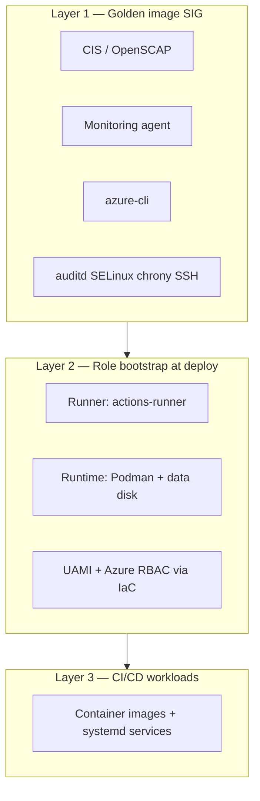
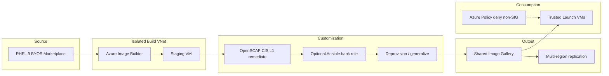

# Architecture: Azure RHEL 9 Golden Image (reference)

> **Engagement fit:** [ENGAGEMENT-ALIGNMENT.md](ENGAGEMENT-ALIGNMENT.md) — **no prod Linux today**; dev uses **Podman**. Primary path: stabilize dev → **three-layer IaC** for UAT/prod. Golden image (Layer 1) is **recommended** when client adopts reference Terraform.

> **SOW / scope:** Reference IaC = **SOW item 6 (KT)**; **client deploys**. Monitoring/build modules = draft patterns under items **2, 4, 6** — not consultant prod implementation (SOW scope boundaries). Network stabilize = separate track ([NETWORK-DISCOVERY-QUESTIONNAIRE.md](NETWORK-DISCOVERY-QUESTIONNAIRE.md)); **out of scope:** consultant `terraform apply` or hub build.

> **Network not in IaC:** `modules/build-network` is image-build spoke **reference** only—not client landing zone replacement.

> **Terminology:** Azure uses **SIG** versions, not AWS AMIs.

## When to use this pipeline

| Client situation | Use golden image repo? |
|------------------|-------------------------|
| Stabilize dev Podman only | **No** SIG — Ansible on existing host |
| UAT/prod Linux (two VMs per env) | **Yes** — Layer 1 SIG + Layer 2 `layer2-workload-stack` |
| Fleet of identical RHEL VMs | **Yes** — full SIG/AIB pipeline |

## Goals (reference pipeline)

- Reproducible, auditable golden images for RHEL 9 on Azure
- Alignment with US financial sector expectations (FFIEC guidance, NIST CSF/800-53 mapping, CIS benchmarks)
- No interactive build steps; full pipeline as Infrastructure as Code (Terraform + optional Ansible)
- Trusted Launch (Secure Boot + vTPM) and private network image builds
- **OS baseline only** — no application workloads, no long-lived app services in the image (industry-standard layering)

## Image layering model (industry standard)

Regulated environments typically separate **three layers**. This repo’s golden image covers **layer 1 only**; client applies layers 2–3 at deploy and via CI/CD.

| Layer | When | Contents | Not in scope for golden image |
|-------|------|----------|-------------------------------|
| **1 — Base golden image** | AIB/SIG build (monthly / on errata) | CIS-hardened RHEL 9, SELinux enforcing, auditd, chrony, SSH hardening, banners, `azure-cli`, **Python 3 / pip / venv / Ansible Core**, monitoring agent (e.g. Logic Monitor), EDR (when approved), compliance artifacts, RHSM-ready, **layer-2 playbooks staged** (not executed) | FastAPI, Dagster, ingestion paths, **Podman app containers**, `actions-runner`, env secrets, hostname/subnet-specific config |
| **2 — Role bootstrap** | VM first boot (cloud-init / Ansible) | **Runner:** `actions-runner`, build tooling, runner UAMI attached via IaC. **Runtime:** Podman engine, data disk mount (UUID/fstab), quadlet/systemd **templates**, runtime UAMI | Application images, production data, per-app secrets |
| **3 — Workload orchestration** | CI/CD + operations | Pull OCI images, enable systemd/quadlet units, Key Vault–backed app config, Dagster/FastAPI/ingestion services | OS re-hardening, ad-hoc image drift |



**Why this meets industry standards**

- **Immutable infrastructure:** OS foundation is versioned (SIG), reproducible, and security-reviewed separately from app releases.
- **Least privilege / blast radius:** App compromise does not require rebaking the org-wide OS image; app changes do not touch CIS baseline.
- **Auditability:** Layer 1 artifacts (`/opt/compliance/artifacts/`) prove build-time controls; layer 3 changes trace to git/CI.
- **Azure alignment:** Trusted Launch + SIG + Policy (deny non-approved images) matches Microsoft financial-services landing-zone patterns.
- **CIS / NIST / FFIEC:** Hardened OS baseline is the expected control point; workloads are configuration management and change control.

**Clarifications**

| Topic | Golden image | At VM deploy (layer 2) |
|-------|--------------|------------------------|
| **Azure RBAC** | Not baked in — no tenant secrets | **UAMI** attached to VM; `AcrPush` / `AcrPull` / Key Vault roles assigned to identity principal |
| **Entra / Linux access** | `sssd` packages optional in image | Entra SSH or AD join configured per environment |
| **Podman** | Optional: engine only if all VMs are container hosts; **recommended:** install on **runtime** role bootstrap only | Runner may use Podman for **build**, not long-lived app services |
| **Monitoring** | Agent installed or install script stub | Logic Monitor config (keys from KV), alerts per env |

## High-level flow



## Components

| Layer | Technology | Responsibility |
|-------|------------|----------------|
| Orchestration | Terraform | SIG, build VNet, AIB template, RBAC, diagnostics |
| OS hardening | OpenSCAP (`scap-security-guide`) | CIS RHEL 9 Level 1 profile remediate + verify artifacts |
| Supplemental config | Ansible (`rhel9_bank_baseline`) | Banners, audit rules, sysctl, build metadata; extend for `azure-cli`, monitoring agent |
| Distribution | Azure SIG | Versioned images, regional replicas |
| Governance | Azure Policy (sample) | Only approved gallery publisher/SKU |

## Security controls embedded in the image

| Control | Implementation |
|---------|----------------|
| CIS benchmark | `oscap` profile `xccdf_org.ssgproject.content_profile_cis` |
| SSH | Root login disabled, password auth disabled |
| Integrity | AIDE initialized; auditd enabled |
| SELinux | Enforcing (Ansible role) |
| FIPS | `fips-mode-setup` in build; crypto policy configurable |
| Trusted Launch | SIG image definition `trusted_launch_enabled` |
| Build isolation | Dedicated VNet/subnet, deny-all inbound NSG |
| Secrets | User-assigned managed identity; no keys in template |
| Evidence | `/opt/compliance/artifacts/` (SCAP results, build metadata) |

## Azure network context

For the industry-standard hub–spoke VNet design (Azure’s equivalent of a multi-VPC landing zone), see **[AZURE-NETWORK-ARCHITECTURE.md](AZURE-NETWORK-ARCHITECTURE.md)**.

## Repository layout

```
infra/terraform/
  modules/build-network/        # Layer 1 — AIB VNet
  modules/sig/                  # Layer 1 — SIG
  modules/image-builder/        # Layer 1 — AIB template
  modules/compute-linux/        # Layer 2 — VM + data disks + cloud-init
  modules/vm-role-bootstrap/    # Layer 2 — cloud-init for runner/runtime
  modules/layer2-workload-stack/# Layer 2 — runner + runtime + UAMI + optional file share
  modules/storage-fileshare/    # Layer 2 — optional Azure Files
  environments/layer1-image-pipeline/  # Layer 1 apply (alias: environments/prod/)
  environments/workload/        # Layer 2 apply
ansible/
  playbooks/golden-image.yml
  roles/rhel9_bank_baseline/
policies/                  # Sample Azure Policy definitions
scripts/                   # Build helpers
docs/                      # Compliance mapping and architecture
```

## Operational model

1. **Bootstrap (once):** `terraform apply` in `infra/terraform/environments/prod`
2. **Build image:** `az image builder run` (or `scripts/trigger-build.sh`)
3. **Promote version:** Tag SIG version; update VMSS/Landing Zone modules to pin version
4. **Patch cadence:** Re-run pipeline monthly or on RH security errata; pin `rhel_source_version` for reproducibility

## Production hardening checklist (client platform — optional pipeline)

*Out of scope for consultant to execute in client tenant.*

- [x] Private endpoints for script storage account (AIB → blob over private link) — `enable_scripts_private_endpoint` in image-builder module
- [ ] Pin marketplace `source_version` (not `latest`)
- [ ] Integrate Log Analytics / Sentinel for AIB diagnostic logs
- [ ] CMK for SIG/storage if required by data classification policy
- [x] Register Red Hat subscription (BYOS) via Key Vault–backed activation in build — set `enable_rhsm` in prod tfvars
- [x] Install `azure-cli` in golden image via `rhel9_bank_baseline` (no `az login` secrets — UAMI at deploy per [VM-DESIGN-CONSIDERATIONS.md](VM-DESIGN-CONSIDERATIONS.md) §6.2)
- [x] Logic Monitor prerequisites + layer-2 bootstrap script via `rhel9_bank_baseline` (`/opt/compliance/bootstrap/enable-logicmonitor-collector.sh`)
- [x] Python 3, pip, venv, Ansible Core in `/opt/ansible/venv`; layer-2 playbooks at `/opt/compliance/ansible/layer2/`
- [x] Layer 2 Terraform: `environments/workload/` + `modules/layer2-workload-stack/`
- [x] Azure Monitor banking baseline: golden image `azure_monitor.yml` + `modules/monitor-baseline/` (DCR, AMA extension, UAMI RBAC)
- [ ] Optional: bake LogicMonitor collector into SIG (`bank_enable_logicmonitor_collector: true` + portal installer URL at AIB build)
- [ ] Deploy EDR agent (CrowdStrike/SentinelOne) via Ansible when vendor approved
- [ ] Confirm image contains **no** app workloads, `actions-runner`, or environment-specific secrets (layer 1 only)
- [ ] Azure Policy initiative: Trusted Launch required, approved SIG only, no public IPs on bank subnets
- [ ] Break-glass account procedures documented; account disabled by default at runtime

## Alternative: CIS Marketplace base

For faster time-to-compliance, start from [CIS Hardened Image for RHEL 9](https://www.cisecurity.org/cis-hardened-images/microsoft) on Azure Marketplace and use this pipeline only for bank-specific layering (agents, NTP, logging forwarders). Trade-off: licensing cost vs. build-time OpenSCAP duration.

---

## Industry references

Full map: [INDUSTRY-REFERENCES.md](INDUSTRY-REFERENCES.md)

| Layer | Primary sources |
|-------|-----------------|
| Golden image | [Azure Image Builder](https://learn.microsoft.com/en-us/azure/virtual-machines/image-builder-overview) · [SIG](https://learn.microsoft.com/en-us/azure/virtual-machines/shared-image-galleries) · [CIS RHEL 9](https://www.cisecurity.org/benchmark/red_hat_linux) · [OpenSCAP](https://www.open-scap.org/) |
| VM deploy | [Trusted Launch](https://learn.microsoft.com/en-us/azure/virtual-machines/trusted-launch) · [CAF Landing Zone](https://learn.microsoft.com/en-us/azure/cloud-adoption-framework/ready/landing-zone/) |
| Monitoring | [Azure Monitor Agent](https://learn.microsoft.com/en-us/azure/azure-monitor/agents/azure-monitor-agent-overview) |
| Compliance | [FFIEC IS Handbook](https://ithandbook.ffiec.gov/) · [NIST SP 800-53](https://csrc.nist.gov/publications/detail/sp/800-53/rev-5/final) |
