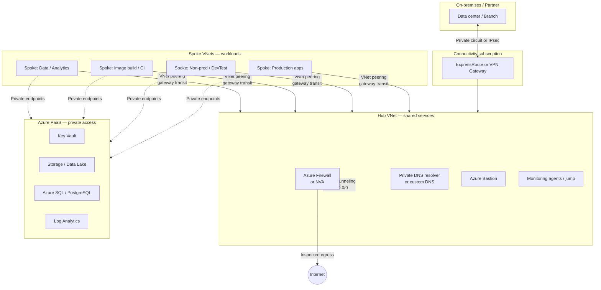
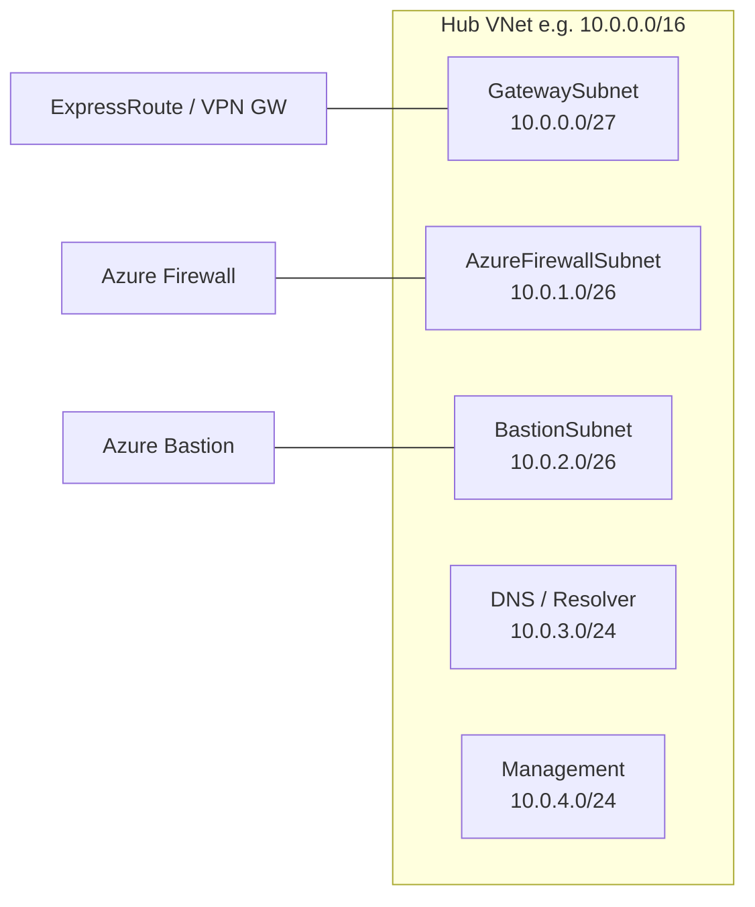
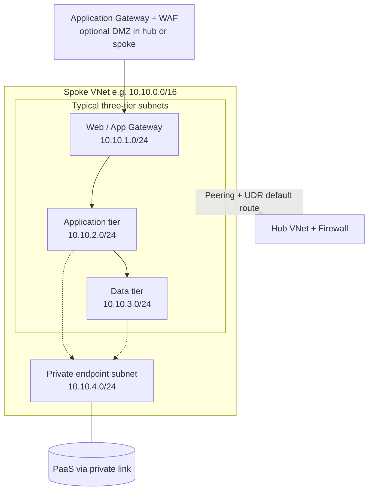
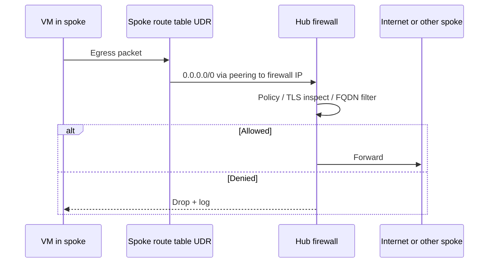
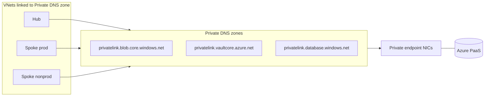
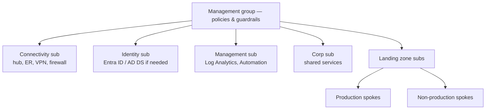

# Azure network architecture (industry-standard hub–spoke)

> **Engagement:** **Track B — stabilize network** ([ENGAGEMENT-ALIGNMENT.md](ENGAGEMENT-ALIGNMENT.md)). Use this doc for **target-state recommendations** and standards language. **Out of scope:** consultant builds hub, spoke, firewall, or network IaC in client Azure.

> **SOW:** Advisory reference only — items **1, 2, 4** (planning, standards, environment recommendations); [SOW.md](SOW.md). Client network **implements** via portal, Firewall Manager, or tickets. Discovery: [NETWORK-DISCOVERY-QUESTIONNAIRE.md](NETWORK-DISCOVERY-QUESTIONNAIRE.md).

> **Network not in IaC:** As-built from diagrams/IPAM/firewall exports → gaps in **risks + recommendations**, not `infra/terraform/`. See [When client network is not in IaC](NETWORK-DISCOVERY-QUESTIONNAIRE.md#when-client-network-is-not-in-iac).

In Azure, a **Virtual Network (VNet)** is the equivalent of an AWS **VPC**. The pattern below is the de facto enterprise and regulated-industry design (Microsoft Cloud Adoption Framework, Azure Landing Zones, and common OCC/FFIEC examiner expectations for segmentation and egress control).

This repo’s golden-image build VNet is a **special-purpose spoke**; production workloads typically land in separate spokes peered to a shared hub.

---

## High-level topology

**Rules of thumb**

| Principle | Implementation |
|-----------|----------------|
| No spoke-to-spoke peering | Traffic between apps crosses the hub (firewall/NVA) |
| Single controlled egress | `0.0.0.0/0` → Azure Firewall in hub via UDR on spoke route tables |
| No public PaaS by default | Private endpoints + `privatelink.*` DNS zones |
| Segregate environments | Separate spokes (or subscriptions) per prod / non-prod |
| Identity over keys | Managed identities + RBAC to PaaS over connection strings |

---

## Hub VNet (shared services)

Typical hub address space: one `/16` or `/20` per region, carved into functional subnets.

| Subnet | Purpose |
|--------|---------|
| `GatewaySubnet` | ExpressRoute or VPN gateway (required name/size) |
| `AzureFirewallSubnet` | Azure Firewall (minimum /26) |
| `AzureBastionSubnet` | Browser-based RDP/SSH without public VM IPs |
| DNS / resolver | Private DNS resolver inbound/outbound endpoints |
| Management | Jump boxes, automation, optional backup proxies |

---

## Spoke VNet (application landing zone)

Each workload or environment gets its own VNet (often its own subscription in landing-zone models).

| Tier | Controls |
|------|----------|
| Web | NSG allow 443 from App Gateway only; no direct Internet inbound to VMs |
| App | NSG allow only from web subnet; outbound via hub firewall |
| Data | Deny Internet; allow app tier only; private endpoints for databases |
| Private endpoints | Dedicated subnet(s) for `Microsoft.*` private link NICs |

---

## Routing and traffic flow

| Route table association | Route | Next hop |
|-------------------------|-------|----------|
| Spoke app subnet | `0.0.0.0/0` | Virtual appliance (firewall private IP in hub) |
| Spoke app subnet | `10.0.0.0/8` (corporate) | Virtual network gateway (via hub) |
| Hub | System routes + optional BGP from ExpressRoute | — |

Enable **gateway transit** on hub peering so spokes use the hub’s ExpressRoute/VPN gateway for hybrid connectivity.

---

## Private DNS and PaaS connectivity

- Create one private DNS zone per PaaS type; link to **all** VNets that must resolve the private endpoint.
- Avoid public endpoints for storage, Key Vault, SQL, etc., in regulated workloads.
- This repo’s **image-build spoke** uses the same pattern for script storage and optional Key Vault during AIB builds.

---

## Landing zone subscriptions (optional scale-out)

Large banks often mirror this logical diagram across **management group** hierarchy:

---

## How this repo fits

| Component in **sika-ye-moja** | Network role | In scope? |
|-------------------------------|--------------|-----------|
| `modules/build-network` | Optional image-build spoke | Reference only; **out of scope** consultant apply |
| This hub–spoke doc | Target-state for **stabilize network** standards | **Advisory** |
| Client prod VM (Workshop 1) | Lives in **existing** manual VNet | Client documents as-built |

Production VMs belong in **app spokes** behind hub policy long term. **Stabilize network** now = document current VNet, fix egress/DNS/firewall for RHEL workloads; **greenfield hub** = Phase 6 / change order, not default SOW.

---

## Reference patterns

Full authority map: [INDUSTRY-REFERENCES.md](INDUSTRY-REFERENCES.md)

- [Azure landing zone — network topology](https://learn.microsoft.com/azure/cloud-adoption-framework/ready/landing-zone/design-area/network-topology-and-connectivity)
- [Hub-spoke network topology](https://learn.microsoft.com/azure/architecture/networking/architecture/hub-spoke)
- [Azure Firewall as forced tunnel](https://learn.microsoft.com/azure/firewall/firewall-multi-virtual-network)
- [Microsoft Cloud Security Benchmark — network](https://learn.microsoft.com/en-us/security/benchmark/azure/security-controls-v3-network-security)
- [FFIEC IS Handbook](https://ithandbook.ffiec.gov/)
