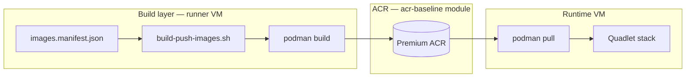

# Container build layer

> **Layer 3 (build)** — GitHub runner builds OCI images from Dockerfiles and pushes to **Azure Container Registry (ACR)**. Runtime VMs are **pull-only**.

---

## Architecture



| Component | Path |
|-----------|------|
| Image catalog | `build/images.manifest.json` |
| Build script | `build/scripts/build-push-images.sh` |
| OCI labels | `build/scripts/lib/oci-labels.sh` |
| ACR IaC | `infra/terraform/modules/acr-baseline/` |
| Runner bootstrap | `ansible/layer2/roles/podman_build_layer/` |
| CI | `.github/workflows/build-images.yml`, `build-deploy.yml` |

---

## Industry standards

| Control | Implementation |
|---------|----------------|
| Registry | **ACR Premium** — admin disabled, public access off, private endpoint |
| Auth | Runner UAMI `AcrPush`; runtime UAMI `AcrPull` only |
| Immutable tags | Primary tag = **git SHA** (not floating `latest` in prod deploy) |
| OCI metadata | `org.opencontainers.image.revision`, `.source`, `.created`, `.version` |
| Quarantine | ACR quarantine policy — scan before runtime pull |
| Retention | Untagged manifest cleanup (30-day default) |
| Build output | `build/artifacts/build-manifest.json` with **digests** for audit |

---

## Add a new image

1. Add `Dockerfile` + context directory.
2. Register in `build/images.manifest.json`:

```json
{
  "name": "my-service",
  "context": "examples/runtime-images/my-service",
  "dockerfile": "Dockerfile",
  "description": "Optional description for OCI label"
}
```

3. If runtime deploy needed, update `deploy-runtime-stack.sh` and Quadlet units.

---

## Manual build (runner VM)

```bash
cd /path/to/repo
ACR_NAME=uatdataplatformacr \
IMAGE_TAG="$(git rev-parse HEAD)" \
IMAGE_SOURCE="$(git config --get remote.origin.url)" \
RUNNER_UAMI_ID="/subscriptions/.../uami-github-runner" \
  ./build/scripts/build-push-images.sh
```

Or wrapper installed at Layer 2:

```bash
CHECKOUT_ROOT=/path/to/repo ACR_NAME=myacr IMAGE_TAG=<sha> RUNNER_UAMI_ID=<uami> \
  /opt/compliance/bootstrap/build-images.sh
```

---

## Provision ACR (client Terraform)

```hcl
module "acr" {
  source = "../../modules/acr-baseline"

  name_prefix                = "uat-data"
  acr_name                   = "uatdataplatformacr"
  location                   = var.location
  resource_group_name        = var.resource_group_name
  private_endpoint_subnet_id = var.pe_subnet_id
  private_dns_zone_ids       = [var.acr_private_dns_zone_id]
}
```

Pass `module.acr.acr_id` to `layer2-workload-stack` as `acr_id`.

---

## GitHub Actions variables

| Variable | Purpose |
|----------|---------|
| `ACR_NAME` | Registry name (no `.azurecr.io`) |
| `RUNNER_UAMI_ID` | Runner identity for `az acr login` |
| `RUNTIME_VM_IP` | Deploy target |
| `RUNTIME_UAMI_ID` | Runtime pull identity |

---

## Industry references

Full map: [INDUSTRY-REFERENCES.md](INDUSTRY-REFERENCES.md)

| Topic | Source |
|-------|--------|
| ACR | [Container registry best practices](https://learn.microsoft.com/en-us/azure/container-registry/container-registry-best-practices) |
| Build security | [NIST SP 800-190](https://csrc.nist.gov/publications/detail/sp/800-190/final) · [SLSA](https://slsa.dev/) |
| GitHub Actions | [Self-hosted runners](https://docs.github.com/en/actions/hosting-your-own-runners/about-self-hosted-runners) · [OIDC with Azure](https://docs.github.com/en/actions/deployment/security-hardening-your-deployments/configuring-openid-connect-in-azure) |
| Base images | [Red Hat UBI](https://catalog.redhat.com/software/containers/ubi9/6189f9ab0f2ec38f9458bc79) |

---

## Document history

| Version | Date | Notes |
|---------|------|-------|
| 0.1 | 2026-05-28 | Initial build layer + acr-baseline |
