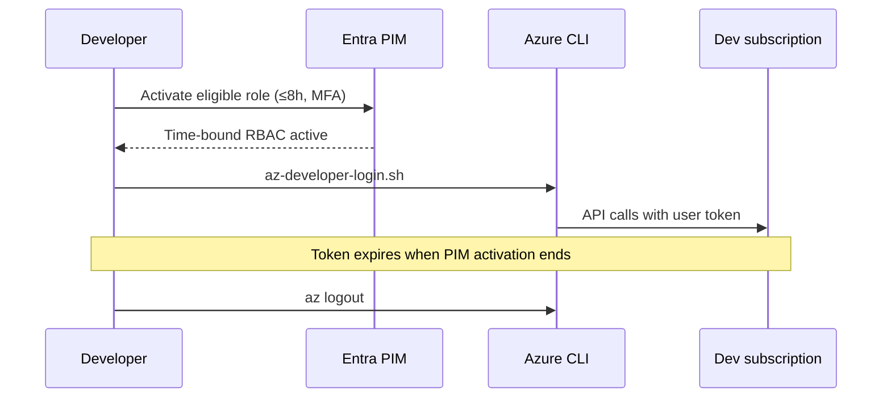

# Developer temporary Azure CLI access

> **Track 2 (identity)** — give **developers** time-bound `az` capability on the **dev subscription** without shared admin accounts or permanent Contributor.

---

## Problem

Developers need Azure CLI for:

- Inspecting dev VMs, NSGs, and private endpoints
- `az acr login` + local `podman push` to dev registry
- Reading dev Key Vault secrets for local testing

**VMs** (runner/runtime) use **UAMI** (`az login --identity`). **Humans** on laptops or Bastion dev hosts use **Entra ID + temporary PIM activation**.

---

## Banking default workflow



| Step | Action |
|------|--------|
| 1 | Patrick adds developer to `grp-platform-developers` (Entra group) |
| 2 | Platform applies **PIM eligible** roles via `developer-cli-access` Terraform module (**dev only**) |
| 3 | Developer activates role in **Entra → PIM → My roles** (justify, MFA, ≤8h) |
| 4 | Developer runs `./scripts/az-developer-login.sh` |
| 5 | Developer uses `az` until activation expires; **`az logout`** when done |

---

## PIM eligible roles (dev scope)

| Role | Scope | CLI examples |
|------|-------|--------------|
| `Reader` | Dev subscription or RG | `az vm list`, `az network nsg rule list` |
| `AcrPush` | Dev ACR | `az acr login --name <acr>`; `podman push` |
| `Key Vault Secrets User` | Dev KV | `az keyvault secret show` |

**Never** on prod/UAT subscriptions for developer group. **Never** `Contributor` or `Owner` for routine dev CLI.

---

## Where to run

| Environment | Login method |
|-------------|--------------|
| Developer laptop (macOS/WSL) | `scripts/az-developer-login.sh` after PIM |
| Dev Linux VM via Bastion | `/opt/compliance/bootstrap/az-login-developer.sh` (same flow) |
| GitHub runner VM | **UAMI** only — not developer Entra login |
| UAT/prod runtime VM | **Runtime UAMI** only — pull-only |

---

## IaC

```hcl
module "developer_cli" {
  source = "../../modules/developer-cli-access"

  developer_group_object_id = var.entra_group_platform_developers_id
  dev_subscription_id       = var.dev_subscription_id
  dev_resource_group_id     = azurerm_resource_group.dev.id
  acr_id                    = module.acr.acr_id
  key_vault_id              = azurerm_key_vault.dev.id
}
```

Configure **PIM activation max duration** (8h) in Entra role settings to match `pim_activation_max_hours`.

---

## Anti-patterns

| Don't | Do instead |
|-------|------------|
| Shared `deploy` user with password | Individual Entra user + PIM |
| Service principal secret on laptop `.env` | PIM + `az login` |
| Permanent Reader on dev sub | PIM eligible only |
| `az login` with prod subscription for devs | `AZURE_DEV_SUBSCRIPTION_ID` in script |
| Developer `az` on UAT/prod runtime VM | UAMI automation only |

---

## Related

- [NETWORK-IAM-STANDARDS.md](NETWORK-IAM-STANDARDS.md) — developer CLI + consultant discovery patterns
- [VM-DESIGN-CONSIDERATIONS.md](VM-DESIGN-CONSIDERATIONS.md) §6.2 — UAMI on VMs
- [STANDARDS-RHEL-PODMAN-v0.1.md](STANDARDS-RHEL-PODMAN-v0.1.md) §2 Identity

---

## Industry references

Full map: [INDUSTRY-REFERENCES.md](INDUSTRY-REFERENCES.md)

| Topic | Source |
|-------|--------|
| Least privilege / JIT | [Entra PIM](https://learn.microsoft.com/en-us/entra/id-governance/privileged-identity-management/pim-configure) · [NIST SP 800-207](https://csrc.nist.gov/publications/detail/sp/800-207/final) |
| Managed identity (VMs) | [Managed identities overview](https://learn.microsoft.com/en-us/entra/identity/managed-identities-azure-resources/overview) |
| Azure CLI identity login | [Sign in with Azure CLI — managed identity](https://learn.microsoft.com/en-us/cli/azure/authenticate-azure-cli#sign-in-with-a-managed-identity) |
| Banking access control | [FFIEC IS Handbook](https://ithandbook.ffiec.gov/) |

---

## Document history

| Version | Date | Notes |
|---------|------|-------|
| 0.1 | 2026-05-28 | Developer PIM + az login workflow |
