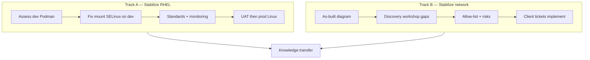

# Engagement alignment (master)

**Use this page** when reviewing or updating any doc in `docs/`. It reflects **Workshop 1 + 2**, the **signed contract** ([SOW.md](SOW.md)), and the **charter addendum** ([CHARTER-ADDENDUM.md](CHARTER-ADDENDUM.md)) where discovery differs from contract wording.

> **Confirmed (client update):** **No production Linux environments today.** All **dev hosts use Podman** (not Docker). Engagement = stabilize **dev** → design **UAT/prod** Linux path. Workshop 1 “RHEL in prod” was **incorrect**. Plan: [NEXT-STEPS.md](NEXT-STEPS.md).

---

## SOW contract baseline (Fortified Data #743101)

| Contract fact | Value |
|---------------|--------|
| Client | Fortified Data |
| Effort | **60 hours**, fixed rate — Linux Architect (advisory) |
| Stated work | Linux Platform Advisory Services: **Ubuntu → RHEL** |
| Nature | **Advisory** — client retains execution and cutover ([SOW.md](SOW.md) Scope Boundaries) |
| Change control | Work outside scope requires **written change order** |

### SOW scope items → repo artifacts

| SOW item | Contract wording | This engagement (via charter) |
|----------|------------------|-------------------------------|
| **1** | Migration planning and technical guidance | [STRATEGY-POST-RHEL.md](STRATEGY-POST-RHEL.md), [NEXT-STEPS.md](NEXT-STEPS.md), [DEV-PODMAN-ASSESSMENT.md](DEV-PODMAN-ASSESSMENT.md), [NETWORK-DISCOVERY-QUESTIONNAIRE.md](NETWORK-DISCOVERY-QUESTIONNAIRE.md) (planning only) |
| **2** | RHEL standards & best practices | [STANDARDS-RHEL-PODMAN-v0.1.md](STANDARDS-RHEL-PODMAN-v0.1.md), [BANKING-PLATFORM-STANDARDS-v1.md](BANKING-PLATFORM-STANDARDS-v1.md), [VM-DESIGN-CONSIDERATIONS.md](VM-DESIGN-CONSIDERATIONS.md) |
| **3** | Risk identification and mitigation | [RISK-REGISTER-v1.md](RISK-REGISTER-v1.md) |
| **4** | Environment improvement recommendations | [ENVIRONMENT-IMPROVEMENT-BACKLOG.md](ENVIRONMENT-IMPROVEMENT-BACKLOG.md), [REGISTRY-AND-SUPPLY-CHAIN.md](REGISTRY-AND-SUPPLY-CHAIN.md), [EGRESS-ALLOW-LIST.md](EGRESS-ALLOW-LIST.md), [NETWORK-IAM-STANDARDS.md](NETWORK-IAM-STANDARDS.md), [INGRESS-DECISION-NGINX-SIDECAR.md](INGRESS-DECISION-NGINX-SIDECAR.md) |
| **5** | Cutover support and post-implementation troubleshooting | [runbooks/](runbooks/); agreed cutover window (client executes) |
| **6** | Knowledge transfer & support planning | [KT-AND-SUPPORT-PLAN.md](KT-AND-SUPPORT-PLAN.md), reference IaC ([ARCHITECTURE.md](ARCHITECTURE.md), `infra/terraform/`), [DELIVERABLES-CHECKLIST.md](DELIVERABLES-CHECKLIST.md) |

**SOW boundary (unchanged):** *Additional security, monitoring, or automation enhancements are out of scope unless defined* ([SOW.md](SOW.md)). Charter treats **reference** monitoring/build patterns as **draft standards + KT (items 2, 4, 6)** — not consultant deployment of SIEM, Logic Monitor, or prod `terraform apply`.

**Do not cite** “SOW §2” in docs — the contract uses **numbered items 1–6**, not sections.

---

## Contract vs current focus

| | Contract ([SOW.md](SOW.md)) | **Current engagement focus** |
|---|---------------------------|------------------------------|
| **Narrative** | Ubuntu → RHEL on Azure | **No prod Linux yet** — stabilize **dev (Podman)** → **UAT → prod** |
| **Workloads** | OS migration | **RHEL + Podman** on dev; Dagster, dbt, Snowflake data platform |
| **Azure build** | Not specified | **Manual** (portal); no client network/compute IaC today |
| **Network** | Not built by consultant | **Stabilize**: as-built, egress, DNS, firewall **recommendations**; **client implements** (often without Terraform) |
| **This repo** | Reference | **Reference IaC** for optional golden image / VM patterns — **not** prod apply by default |

**Action:** Client PM signs short **charter addendum** aligning SOW deliverables to the “current focus” column.

---

## Dual workstreams

| Track | Goal | Consultant | Client | Out of scope for consultant |
|-------|------|------------|--------|------------------------------|
| **A — RHEL** | Reliable **dev**; repeatable **UAT/prod** Linux (greenfield) | Assess dev Podman, standards, UAT/prod design, reference IaC KT | Mount, SELinux, deploy UAT/prod, cutover execute | App fixes, license buy, 24×7 ops |
| **B — Network** | Known paths for patch, Snowflake, build, DR | Diagram review, questionnaire, allow-list draft, risks | Firewall, PE, DNS, peering, UDR, CAB | Hub build, terraform apply in network sub, SOC |

Tracks run **in parallel**; network **blockers** gate UAT/new VMs (Track A).

---

## In scope (consultant delivers) — mapped to SOW items

| SOW item | Deliverable | Workstream |
|----------|-------------|------------|
| **1** | Migration / stabilization **plan** + network discovery (requirements only) | A + B |
| **2** | **RHEL + Podman on Azure** standards — [STANDARDS-RHEL-PODMAN-v0.1.md](STANDARDS-RHEL-PODMAN-v0.1.md) | A |
| **3** | **Risk register** — [RISK-REGISTER-v1.md](RISK-REGISTER-v1.md) | A + B |
| **4** | Environment **improvement** recommendations — egress, network/IAM, ingress decision, VM design | A + B |
| **5** | Cutover **support** (agreed window) + runbook **drafts** | A + B |
| **6** | **Knowledge transfer** + reference IaC handoff | A (+ B KT on network runbooks) |
| — | **Charter addendum** (align contract to discovery) — [CHARTER-ADDENDUM.md](CHARTER-ADDENDUM.md) | PM |

---

## Out of scope (unless change order)

| Item | Owner |
|------|--------|
| **Execution** of migration, cutover, firewall, deploy (SOW: client retains) | Client |
| **RHEL licensing**, backups before prod changes (SOW assumptions) | Client |
| **Application remediation** (SOW assumptions) | Client |
| **Security / monitoring / automation enhancements** beyond draft standards & KT (SOW scope boundaries) | Client unless change order |
| Ubuntu → RHEL **as stated in contract** | Superseded by charter — dev already RHEL + Podman |
| **Application** remediation, K8s/APIM **build**, NGINX replacement | Client app/platform |
| **Implementing** hub, spoke, firewall, PE, ExpressRoute | Client network |
| **Network IaC** authoring in client subscription | Client |
| **terraform apply** in client prod (network or platform) | Client |
| RHEL **license** purchase | Client |
| Backups, DR **execution**, ASR test | Client |
| SIEM/SOC, Logic Monitor **deploy** | Client |
| CIS/audit **attestation**, pen test | Client GRC / vendor |
| **Mandatory** golden image / AIB for single bespoke host | Optional reference only |
| Linux **admin hire** and day-2 ops | Client |

---

## Reference IaC in this repo

| Module | Purpose | When client needs it |
|--------|---------|----------------------|
| `image-builder`, `sig`, `build-network` | Golden image pipeline | **Many** new homogeneous RHEL VMs |
| `acr-baseline` | Banking ACR (private, quarantine) | Container supply chain |
| `compute-linux`, `nsg-baseline`, `monitor-baseline`, `layer2-workload-stack` | Layer 2 VMs + NSG + UAMI + Azure Monitor DCR/AMA | UAT/prod from SIG |
| `build/` + Layer 3 workflows | Podman build → ACR push | Runner VM only |
| `developer-cli-access` | PIM eligible RBAC for developer `az` CLI (dev sub) | Developer laptops + dev Bastion |
| `storage-fileshare` | Optional Azure Files | Shared ingestion |
| _None_ | Replace manual network | **Not in contract** — advisory only; [NETWORK-TO-TFVARS-BRIDGE.md](NETWORK-TO-TFVARS-BRIDGE.md) |

**Primary path (confirmed):** Track A **dev Podman** harden + automate deploy/registry → **UAT/prod Linux** (new VMs, client IaC); golden image **optional**; Track B **network tickets**.

---

## Consultant access (current)

| Access | Status | Unblocks |
|--------|--------|----------|
| **Dev Linux VM** (SSH/Bastion) | **Granted** | Track A Podman assessment (ClickUp #13) |
| **Azure subscription** Reader (dev + prod subs) | **Pending** — Patrick/platform | VM↔Azure mapping, NSG, VNet, Track B (ClickUp #14) |

### Developer temporary CLI (Track 2)

Developers get **time-bound `az` capability** on the **dev subscription** via PIM + interactive login — not shared admin, not SP secrets on laptops. See [DEVELOPER-AZURE-CLI-ACCESS.md](DEVELOPER-AZURE-CLI-ACCESS.md) and `modules/developer-cli-access/`.

### Consultant discovery access (Track B)

Do **not** issue permanent `Reader` or shared accounts for network discovery. **Banking default** ([NETWORK-IAM-STANDARDS.md](NETWORK-IAM-STANDARDS.md)):

1. **Individual Entra user** per consultant (guest invite acceptable).
2. **PIM eligible** `Reader` on dev + prod subscriptions — activate JIT (MFA, ≤8h, optional approval).
3. **No** service principal secrets, **no** Contributor, **no** shared admin.
4. **Remove** eligible assignments when engagement ends (access review).

This pattern applies equally to client network engineers validating consultant drafts — per-user Entra, time-bound elevation, not standing Owner on workload subscriptions.

Request **`Reader`** only at subscription scope — activated temporarily via PIM, not permanently assigned.

---

## Document map

| Document | Role | Aligned? |
|----------|------|----------|
| **[ENGAGEMENT-ALIGNMENT.md](ENGAGEMENT-ALIGNMENT.md)** | **This file** — scope truth | — |
| [DELIVERABLES-CHECKLIST.md](DELIVERABLES-CHECKLIST.md) | Consultant deliverable tracker | — |
| [SOW.md](SOW.md) | **Original contract** (Fortified #743101, 60h advisory) | Linted; do not rewrite |
| [CHARTER-ADDENDUM.md](CHARTER-ADDENDUM.md) | Aligns contract to discovery | Draft — client sign-off |
| [STRATEGY-POST-RHEL.md](STRATEGY-POST-RHEL.md) | Phased plan (RHEL + network) | Primary execution guide |
| [discovery-workshop-1.md](discovery-workshop-1.md) | Workshop 1 facts | **Superseded** for prod/Podman — use W2 |
| [STANDARDS-RHEL-PODMAN-v0.1.md](STANDARDS-RHEL-PODMAN-v0.1.md) | RHEL + Podman technical standards | v0.1 |
| [INDUSTRY-REFERENCES.md](INDUSTRY-REFERENCES.md) | External authority links (CIS, NIST, FFIEC, Azure) | v1 |
| [BANKING-PLATFORM-STANDARDS-v1.md](BANKING-PLATFORM-STANDARDS-v1.md) | Opinionated industry baseline (gaps) | v1 |
| [PODMAN-DEPLOY-GAP-LIST.md](PODMAN-DEPLOY-GAP-LIST.md) | Dev vs target gap register | Draft |
| [ENVIRONMENT-IMPROVEMENT-BACKLOG.md](ENVIRONMENT-IMPROVEMENT-BACKLOG.md) | Prioritized env recommendations | Draft |
| [REGISTRY-AND-SUPPLY-CHAIN.md](REGISTRY-AND-SUPPLY-CHAIN.md) | ACR decision + supply chain | Draft |
| [KT-AND-SUPPORT-PLAN.md](KT-AND-SUPPORT-PLAN.md) | KT sessions + handoff | Draft |
| [runbooks/](runbooks/) | Cutover, promotion, ops, network | Draft |
| [NETWORK-IAM-STANDARDS.md](NETWORK-IAM-STANDARDS.md) | NSG + UAMI prescriptive model | v0.1 |
| [NETWORK-TO-TFVARS-BRIDGE.md](NETWORK-TO-TFVARS-BRIDGE.md) | As-built → Terraform | v0.1 |
| [RISK-REGISTER-v1.md](RISK-REGISTER-v1.md) | Consolidated risks | v1 |
| [EGRESS-ALLOW-LIST.md](EGRESS-ALLOW-LIST.md) | Firewall draft | v0.1 |
| [CLARIFICATIONS-WITH-DEV-TEAM.md](CLARIFICATIONS-WITH-DEV-TEAM.md) | Questions for Anatoliy | Use before deep-dive |
| [NETWORK-DISCOVERY-QUESTIONNAIRE.md](NETWORK-DISCOVERY-QUESTIONNAIRE.md) | Track B questions | Network stabilize |
| [CLICKUP-DISCOVERY-TICKETS.md](CLICKUP-DISCOVERY-TICKETS.md) | Tasks | Both tracks |
| [ARCHITECTURE.md](ARCHITECTURE.md) | Optional golden image | Track A optional |
| [AZURE-NETWORK-ARCHITECTURE.md](AZURE-NETWORK-ARCHITECTURE.md) | Target-state reference | Track B advisory |
| [COMPLIANCE.md](COMPLIANCE.md) | Informational mapping | Not sign-off |
| [VM-DESIGN-CONSIDERATIONS.md](VM-DESIGN-CONSIDERATIONS.md) | UAT/prod VM design checklist | Track A |

---

## Quick redirects (client questions)

| Question | Answer |
|----------|--------|
| “Will you fix our firewall?” | **No** — we draft rules/requirements; network team implements. |
| “Will you terraform our hub?” | **Out of scope** — reference patterns only. |
| “Will you migrate Ubuntu prod to RHEL?” | **No prod Linux yet** — dev Podman → UAT → prod. |
| “Will you deploy this repo?” | **Client platform** deploys; we advise and KT. |
| “Will you fix Podman/app bugs?” | **Out of scope** — app team. |
