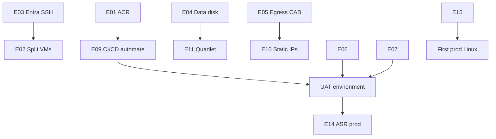

# Environment improvement backlog

> **SOW item 4** — prioritized recommendations. Client implements via platform/network tickets. Opinionated priorities from [BANKING-PLATFORM-STANDARDS-v1.md](BANKING-PLATFORM-STANDARDS-v1.md). Industry authorities: [INDUSTRY-REFERENCES.md](INDUSTRY-REFERENCES.md).

---

## Priority legend

| Priority | Meaning |
|----------|---------|
| **P0** | Blocks UAT or security sign-off |
| **P1** | Required for prod Linux go-live |
| **P2** | Hardening / efficiency |
| **P3** | Future / change order |

---

## Backlog

| ID | Recommendation | Priority | Owner | Ticket / ref | Status |
|----|----------------|----------|-------|--------------|--------|
| E01 | Adopt **ACR Premium** with private endpoint in dev sub | P0 | Patrick | ACR module | Open |
| E02 | Split **runner + runtime VMs** on dev (stop co-location) | P0 | Anatoliy | Platform | Open |
| E03 | Implement **Entra ID SSH**; retire shared admin | P0 | Patrick | IAM | Open |
| E04 | Fix **data disk mount** (UUID fstab) on dev | P0 | Anatoliy | Ops | Open |
| E05 | Submit **egress allow-list** to CAB | P1 | Tim → Patrick | Network | Draft ready |
| E06 | Provision **two UAMIs** per env with RBAC split | P1 | Patrick | IaC | Open |
| E07 | Enable **Azure Monitor AMA + DCR** on Linux VMs | P1 | Patrick | Monitor module | Reference ready |
| E08 | Assign **Azure Policy** initiative (SIG-only, no public IP, Trusted Launch) | P1 | GRC + Patrick | `policies/` | Open |
| E09 | Automate **build → push → deploy** via GitHub Actions | P1 | Anatoliy | CI/CD | Open |
| E10 | Document **static private IPs** in IPAM + firewall | P1 | Network | IPAM | Open |
| E11 | **Quadlet**-based runtime units in git | P1 | Anatoliy | App config | Open |
| E12 | **PIM eligible Reader** for consultant discovery | P1 | Patrick | IAM | Open |
| E13 | **Developer PIM** pattern on dev sub | P1 | Patrick | `developer-cli-access` | Reference ready |
| E14 | **ASR** for runtime VM + data disk | P1 | Client BCP | DR | Open |
| E15 | **Image signing** on ACR before prod | P1 | Kirk | Security | Open |
| E16 | **nginx sidecar** ingress until APIM decision | P2 | Anatoliy | ING-6 | Default |
| E17 | **Logic Monitor** collectors on Linux (Patrick stack) | P2 | Patrick | Monitoring | Open |
| E18 | **Azure Files NFS** for shared ingestion (if needed) | P2 | Anatoliy | Storage module | Optional |
| E19 | **SIG golden image** pipeline for homogeneous UAT/prod | P2 | Patrick | Layer 1 | Optional |
| E20 | **APIM** front door for APIs | P3 | Architecture | Change order | Deferred |
| E21 | **AKS** migration assessment | P3 | Architecture | Change order | Deferred |
| E22 | **ExpressRoute** / hub redesign | P3 | Network | Change order | Deferred |

---

## Sequencing (recommended)

---

## Acceptance

Client PM acknowledges backlog priority by: _[date]_

| Role | Name | Signature |
|------|------|-----------|
| Client PM | | |
| Platform (Patrick) | | |
| Vaco lead | | |
