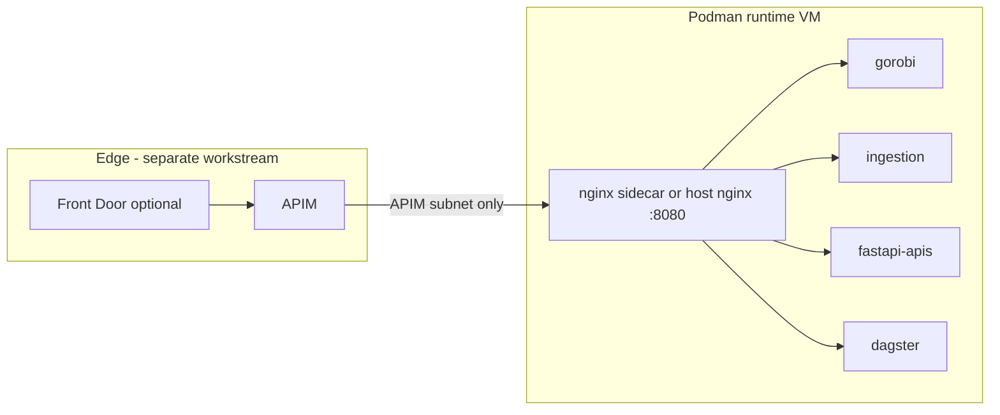

# Runtime ingress decision — nginx sidecar vs alternatives

> **Decision point:** Workshop 2 **W2-Q1** (NGINX vs APIM for routing/SSL) and **R-W2-6** (scope creep if bundled with Linux uplift).  
> **Scope:** Advisory — consultant documents options; **client platform approves and implements**. APIM **build** is out of scope unless change order.

**Related:** [discovery-workshop-2.md](discovery-workshop-2.md) · [STANDARDS-RHEL-PODMAN-v0.1.md](STANDARDS-RHEL-PODMAN-v0.1.md) · [RUNTIME-WORKLOAD-EXAMPLE.md](RUNTIME-WORKLOAD-EXAMPLE.md) · [VM-DESIGN-CONSIDERATIONS.md](VM-DESIGN-CONSIDERATIONS.md) · [NETWORK-IAM-STANDARDS.md](NETWORK-IAM-STANDARDS.md)

---

## 1. Decision summary

| Field | Value |
|-------|--------|
| **Question** | Should the Podman runtime VM use an **nginx sidecar** (Quadlet), **host nginx**, **APIM-only** ingress, or a **hybrid** (APIM + local proxy)? |
| **Default in standards v0.1** | **nginx sidecar** — sole published host port (`8080`); app containers internal only |
| **Status** | **Open** — pending dev service inventory and client platform sign-off |
| **Risk if deferred** | NSG rules, Terraform `apim_subnet_prefix`, and Quadlet templates may not match chosen path |
| **Risk if bundled early** | APIM workstream delays Linux uplift (charter boundary) |

---

## 2. Context

### Current state (dev)

- Shared Linux runtime host with **multiple Podman services** (Gorobi, ingestion, FastAPI APIs, Dagster).
- **NGINX** already used as reverse proxy (typically **host-level** today).
- **Token validation** duplicated in application code; initiative to centralize at **APIM** (e.g. Gorobi route).
- Deploy path **not fully automated**; dev assessment in progress ([DEV-PODMAN-ASSESSMENT.md](DEV-PODMAN-ASSESSMENT.md)).

### Target reference stack

Four HTTP workloads behind one published port — see [RUNTIME-WORKLOAD-EXAMPLE.md](RUNTIME-WORKLOAD-EXAMPLE.md):

| Service | Internal port | Path |
|---------|---------------|------|
| Gorobi | 8010 | `/gorobi/` |
| Ingestion | 8020 | `/ingestion/` |
| FastAPI APIs | 8000 | `/api/` |
| Dagster | 3000 | `/dagster/` |

**Network rule (standards):** runtime NSG allows app inbound from **APIM subnet CIDR** (or internal consumers in dev) — not from the internet directly.

---

## 3. Options

| ID | Pattern | Description |
|----|---------|-------------|
| **A** | **nginx sidecar (Quadlet)** | Containerized nginx on Podman internal network; **only** `nginx-proxy` publishes `8080`. Prescriptive default in standards. |
| **B** | **Host nginx** | `nginx` package on RHEL; proxy to `127.0.0.1:8010`, etc. Same routing rules; not pull-deployed as OCI image. |
| **C** | **APIM only** | APIM reverse-proxies to each backend URL/port (or one URL if single service). No local proxy on VM. |
| **D** | **APIM + nginx sidecar (hybrid)** | APIM: TLS, JWT/API keys, products, external API surface. nginx sidecar: path routing across containers on one VM. **Recommended target** for multi-service runtime. |
| **E** | **APIM + host nginx** | Same as D but host nginx instead of sidecar — lower Quadlet complexity; less container-parity with apps. |

---

## 4. Pros and cons

### A — nginx sidecar (Quadlet) — standards default

| Pros | Cons |
|------|------|
| **Single published port** — aligns with NSG “one ingress” model | Extra container to operate (health check, upgrades, memory ~64–128 MB) |
| App containers **not exposed** on host network — banking-friendly | SELinux volume mounts (`:Z`) and config paths add bootstrap complexity |
| Same **pull-only** deploy model as apps (ACR image + Quadlet) | Overkill if **one** HTTP service and host nginx already works in dev |
| Natural **path routing** for Gorobi, ingestion, `/api/`, Dagster WebSocket | Does **not** replace APIM for centralized token validation |
| Consistent with reference IaC (`podman_runtime_workload` role) | Migration churn if dev already stable on host nginx |
| Rate limits and security headers at local edge | APIM still required for external auth if VM has no public IP |

### B — Host nginx on VM

| Pros | Cons |
|------|------|
| **Simplest** ops for dev — familiar pattern, no extra container | Ingress config lives **outside** container lifecycle (Ansible vs image tag) |
| Easy debugging (`nginx -t`, host logs) | Weaker parity between dev/UAT/prod if prod uses sidecar |
| Lower resource overhead than sidecar | Still need APIM (or other edge) for centralized tokens |
| Same path-routing capability as sidecar | Golden image may need nginx package + hardening review |
| Fastest path to stabilize **current dev** | Pull-only runtime standard prefers OCI-managed ingress image |

### C — APIM only (no local nginx)

| Pros | Cons |
|------|------|
| **Managed** reverse proxy + auth — matches SaaS preference | **Multiple backends** in APIM for each container/port on same VM (operational overhead) |
| Removes per-service token code (Gorobi first) | APIM is **out of scope** for v1 Linux uplift unless change order |
| Centralized analytics, throttling, developer portal | Extra network hop; latency vs on-box proxy |
| Can terminate TLS at edge without VM public IP | **Dagster WebSocket** and path-heavy local routing less ergonomic than nginx |
| Strong audit story for API access | Using APIM as dumb pass-through underuses the service |
| | NSG still needs defined source (APIM subnet) |

### D — APIM + nginx sidecar (hybrid)

| Pros | Cons |
|------|------|
| **Clear separation:** APIM = security/governance; nginx = local fan-out | Two layers to design, test, and document |
| One APIM backend URL → VM `:8080`; nginx splits internally | Requires APIM subnet + `apim_subnet_prefix` in Terraform |
| Supports **Gorobi token policy** at APIM without nginx Lua | Two workstreams — must not block Linux uplift on APIM readiness |
| Matches reference architecture and workshop direction | Cost of APIM SKU + nginx container |
| Scales when adding services (new Quadlet + `location` block) | |
| Keeps runtime VM off the public internet | |

### E — APIM + host nginx

| Pros | Cons |
|------|------|
| Hybrid benefits of D with **lower** container count | Split between host package and containerized apps |
| Practical **dev → UAT** bridge if dev already on host nginx | Standards drift if prod adopts sidecar later |
| APIM backend still single URL `:8080` | Same APIM out-of-scope boundary as C/D |

---

## 5. APIM as reverse proxy (clarification)

**Yes — APIM can act as a reverse proxy.** It accepts HTTP(S), applies policies, and forwards to backends. That is not the same as replacing **on-VM** routing:

| Concern | APIM | nginx (sidecar or host) |
|---------|------|-------------------------|
| JWT / OAuth at edge | **Primary fit** | Possible but awkward |
| Route `/gorobi`, `/api/` on **one VM IP** | One backend URL; path rewrite policies possible but clunky for many local services | **Primary fit** |
| Multiple containers, one published port | Needs local proxy **or** many APIM backends | **Primary fit** |
| Dagster UI / WebSocket | Supported with limits; nginx often simpler locally | **Primary fit** |
| Cost / charter | Separate project / CO | In scope for Linux standards |

---

## 6. Decision criteria

Use after **service inventory** (NEXT-STEPS 1.2) is complete.

| Criterion | Favors sidecar / host nginx | Favors APIM-only (no local proxy) |
|-----------|----------------------------|-----------------------------------|
| HTTP services on **one** runtime VM | **2+** services | **1** public HTTP service |
| Need **one** NSG app port | Yes | Single service direct to APIM |
| Centralized **token validation** | APIM upstream (either way) | APIM |
| **Dev stabilization** priority | Host nginx (**B**) acceptable short-term | Wait for APIM before UAT |
| **Container-parity** deploy (pull-only) | Sidecar (**A** or **D**) | N/A |
| **Charter / timeline** | Local proxy in Linux uplift | APIM build deferred |

---

## 7. Recommendation (advisory)

| Phase | Ingress choice | Rationale |
|-------|----------------|-----------|
| **Dev (now)** | **B — host nginx** if already working; do not block on sidecar migration | Mount/SELinux/deploy automation are higher priority |
| **UAT / prod (Linux uplift v1)** | **D — APIM + nginx sidecar** *when* multi-service stack confirmed | Matches standards, NSG model, and reference stack |
| **UAT / prod (single API only)** | **APIM → single container port**; sidecar **optional** | Avoid unnecessary container if inventory shows one HTTP surface |
| **APIM workstream** | **Separate** from OS uplift — Gorobi first route | W2-D2; out of scope unless CO |

**Default until client decides otherwise:** retain **nginx sidecar** in [STANDARDS-RHEL-PODMAN-v0.1.md](STANDARDS-RHEL-PODMAN-v0.1.md) and reference Ansible/Terraform; record explicit override in §9 sign-off if choosing B, C, or E.

---

## 8. Deliverables

### 8.1 Consultant (this engagement)

| ID | Deliverable | Status | Target |
|----|-------------|--------|--------|
| **ING-1** | This decision document (options, pros/cons, criteria) | **Done** | Week 2–3 |
| **ING-2** | Update standards ingress row if client selects non-default option | Pending sign-off | After ING-6 |
| **ING-3** | NSG / allow-list alignment note in [EGRESS-ALLOW-LIST.md](EGRESS-ALLOW-LIST.md) or [NETWORK-TO-TFVARS-BRIDGE.md](NETWORK-TO-TFVARS-BRIDGE.md) | Pending | With network workshop |
| **ING-4** | Reference stack note in [RUNTIME-WORKLOAD-EXAMPLE.md](RUNTIME-WORKLOAD-EXAMPLE.md) if paths/ports change | As needed | Phase 2 |

### 8.2 Client

| ID | Deliverable | Owner | Blocks |
|----|-------------|-------|--------|
| **ING-5** | **HTTP service inventory** — which services need external ingress vs internal-only (Dagster daemon, batch, etc.) | Anatoliy | Decision |
| **ING-6** | **Signed ingress choice** (A–E) for dev vs UAT vs prod | Anatoliy / platform | ING-2, Terraform NSG |
| **ING-7** | Current nginx config export (host paths, `location` blocks, TLS) | Anatoliy | Dev migration plan |
| **ING-8** | APIM workstream charter (if **C**, **D**, or **E**) — Gorobi pilot route, token policy, subnet | Anatoliy | APIM implementation |
| **ING-9** | APIM subnet CIDR for firewall + `apim_subnet_prefix` tfvars | Network / Patrick | Runtime NSG lockdown |

### 8.3 APIM workstream (out of scope unless change order)

| ID | Deliverable | Owner | Notes |
|----|-------------|-------|-------|
| **ING-10** | APIM instance + VNet/internal mode (if required) | Client platform | Separate project |
| **ING-11** | API definitions: Gorobi, optional ingestion/API products | Client platform | Remove app-level token checks after pilot |
| **ING-12** | Front Door + WAF (optional) | Client platform | Pairs with APIM; not required for dev |
| **ING-13** | Policy: JWT validate, rate limit, backend = runtime `:8080` | Client platform | Consultant may review advisory |

### 8.4 IaC / automation (client implements)

| ID | Deliverable | Location | When |
|----|-------------|----------|------|
| **ING-14** | Quadlet + nginx sidecar templates | `ansible/layer2/roles/podman_runtime_workload/` | Option A or D |
| **ING-15** | Host nginx Ansible role or cloud-init | New or compliance path | Option B or E |
| **ING-16** | `runtime_app_ports` / NSG APIM source CIDR | `infra/terraform/modules/compute-linux/` | UAT prep |
| **ING-17** | `apim_subnet_prefix` in workload tfvars | [NETWORK-TO-TFVARS-BRIDGE.md](NETWORK-TO-TFVARS-BRIDGE.md) | When APIM subnet known |

---

## 9. Decision record (sign-off)

| Field | Value |
|-------|--------|
| **Chosen option (dev)** | _[ A / B / C / D / E ]_ |
| **Chosen option (UAT/prod)** | _[ A / B / C / D / E ]_ |
| **APIM workstream** | _[ Separate CO / Deferred / N/A ]_ |
| **Effective date** | _[date]_ |
| **Approver** | _[Anatoliy / platform]_ |

---

## 10. Industry references

Full map: [INDUSTRY-REFERENCES.md](INDUSTRY-REFERENCES.md)

| Option | Source |
|--------|--------|
| nginx sidecar | [nginx proxy module](https://nginx.org/en/docs/http/ngx_http_proxy_module.html) · [NIST SP 800-190](https://csrc.nist.gov/publications/detail/sp/800-190/final) (network segmentation) |
| APIM | [Azure API Management](https://learn.microsoft.com/en-us/azure/api-management/api-management-key-concepts) |
| API security | [OWASP API Security Top 10](https://owasp.org/www-project-api-security/) |
| Banking edge | [MCSB network security](https://learn.microsoft.com/en-us/security/benchmark/azure/security-controls-v3-network-security) |

---

## 11. Document history

| Version | Date | Notes |
|---------|------|-------|
| 0.1 | 2026-06-08 | Initial decision point — nginx sidecar vs host nginx vs APIM; deliverables for W2-Q1 |
