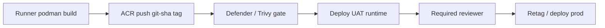

# Registry and supply chain — advisory decision (ACR)

> **SOW item 4** — environment improvement recommendation. **Opinionated default: ACR Premium** before UAT.

---

## Decision summary

| Option | Verdict | Use when |
|--------|---------|----------|
| **Azure Container Registry (Premium)** | **Recommended** | UAT/prod path; banking private endpoint + RBAC |
| **GitHub Container Registry (GHCR)** | **Transitional dev only** | Phase 1 if ACR provisioning delayed — **must migrate** |
| **Docker Hub / public registries** | **Reject** | Audit and egress risk |

---

## ACR Premium — required capabilities

| Capability | Setting |
|------------|---------|
| SKU | **Premium** |
| Admin user | **Disabled** |
| Public network | **Disabled** |
| Private endpoint | **Required** in app/build VNet |
| Content trust / signing | **Enabled** before prod |
| Quarantine policy | **Enabled** — scan before pull to runtime |
| Geo-replication | **Prod** registry only (optional DR) |
| Retention | Untagged >30d purge; keep 10 tags/app |

---

## Identity model

| Principal | ACR role | Scope |
|-----------|----------|-------|
| Runner UAMI | `AcrPush` | Target repos only (`gorobi`, `ingestion`, `apis`, `dagster`) |
| Runtime UAMI | `AcrPull` | Same repos — **no** push |
| Developer (human) | `AcrPush` via PIM | **Dev ACR only** |
| CI workflow | OIDC federated credential | Optional alongside UAMI |

---

## Image lifecycle

| Stage | Tag pattern | Mutable? |
|-------|-------------|----------|
| Dev build | `gorobi:abc1234` | No (immutable) |
| UAT pointer | `gorobi:uat-latest` | Yes |
| Prod pointer | `gorobi:prod-latest` | Yes |
| Release | `gorobi:v1.2.3` | No |

---

## GHCR migration path (if dev uses GHCR today)

| Week | Action |
|------|--------|
| 1–2 | Provision `acr-baseline` in dev sub |
| 2 | Update `build/images.manifest.json`; dual-push dev only |
| 3 | Switch runtime pull to ACR on dev |
| 4 | Disable GHCR pull on UAT/prod paths |
| UAT gate | **No GHCR** references in UAT/prod workflows |

---

## Supply-chain controls (banking)

| Control | Implementation |
|---------|----------------|
| SBOM | Generate Syft SBOM in CI; store as workflow artifact |
| Provenance | SLSA Level 2 target — signed workflow + pinned actions |
| Base image pin | `FROM registry.redhat.io/ubi9/ubi:9.x` with digest in Dockerfile |
| Secret scan | Gitleaks in PR workflow |
| CRITICAL CVE | Block merge to `main` if CRITICAL in built image |

---

## Reference implementation

- Terraform: `infra/terraform/modules/acr-baseline/`
- Build: `build/scripts/build-push-images.sh`, `build/images.manifest.json`
- Workflow: `.github/workflows/build-images.yml`

**Client sign-off:** _[ ] ACR Premium adopted  _[ ] GHCR exception documented_

---

## Industry references

Full map: [INDUSTRY-REFERENCES.md](INDUSTRY-REFERENCES.md)

| Topic | Source |
|-------|--------|
| ACR security | [Container registry best practices](https://learn.microsoft.com/en-us/azure/container-registry/container-registry-best-practices) · [ACR authentication](https://learn.microsoft.com/en-us/azure/container-registry/acs-authentication-managed-identity) |
| Content trust | [Container image trust](https://learn.microsoft.com/en-us/azure/container-registry/container-registry-content-trust) |
| Vulnerability scanning | [Defender for Containers](https://learn.microsoft.com/en-us/azure/defender-for-cloud/defender-for-containers-introduction) |
| Container security | [NIST SP 800-190](https://csrc.nist.gov/publications/detail/sp/800-190/final) |
| Supply chain | [SLSA](https://slsa.dev/) · [OpenSSF](https://openssf.org/) |
| Base images | [Red Hat UBI](https://catalog.redhat.com/software/containers/ubi9/6189f9ab0f2ec38f9458bc79) |
