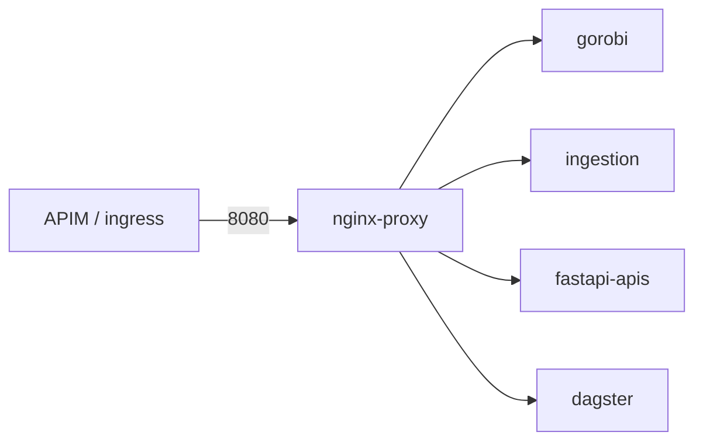

# Podman runtime workload example (data platform services)

> Reference stack for **Gorobi**, **ingestion**, **FastAPI APIs**, and **Dagster** behind an nginx ingress. Ingress options and sign-off: [INGRESS-DECISION-NGINX-SIDECAR.md](INGRESS-DECISION-NGINX-SIDECAR.md).

---

## Architecture



| Service | Internal port | nginx path | Notes |
|---------|---------------|------------|-------|
| **Gorobi** | 8010 | `/gorobi/` | APIM token validation upstream; Charles River integration |
| **Ingestion** | 8020 | `/ingestion/` | Staging volume at `/data/ingestion` (data disk or Azure Files) |
| **FastAPI APIs** | 8000 | `/api/` | General microservices |
| **Dagster** | 3000 | `/dagster/` | Webserver reference — add `dagster-daemon` in production |

---

## Layers

| Layer | Delivers |
|-------|----------|
| **1 — SIG** | Podman engine, compliance scripts |
| **2 — Ansible** | Quadlet per service + nginx routing (stack **stopped**) |
| **3 — Build + deploy** | `build/images.manifest.json` → ACR → `deploy-runtime-stack.sh` |

---

## Images (`examples/runtime-images/`)

| Directory | ACR name | Standards |
|-----------|----------|-----------|
| `gorobi/` | `gorobi` | FastAPI, non-root, health/ready |
| `ingestion/` | `ingestion` | Writable volume mount for staging |
| `fastapi-apis/` | `fastapi-apis` | FastAPI microservices reference |
| `dagster/` | `dagster` | Dagster webserver + minimal workspace |
| `nginx/` | `nginx-proxy` | Path routing, rate limits, WebSocket for Dagster UI |

---

## Quadlet units

| Unit | Host publish |
|------|----------------|
| `bank-runtime-net.network` | — |
| `gorobi.container` | No |
| `ingestion.container` | No |
| `fastapi-apis.container` | No |
| `dagster.container` | No |
| `nginx-proxy.container` | **8080** |

---

## Deploy

```bash
ACR_NAME=<acr> IMAGE_TAG=<git-sha> RUNTIME_UAMI_ID=<uami-id> \
  /opt/compliance/bootstrap/deploy-runtime-stack.sh
```

---

## Production notes

- Replace reference FastAPI/Dagster code with client definitions and dbt/Snowflake assets.
- Run **dagster-daemon** as a separate Quadlet unit when enabling schedules/sensors.
- Map **ingestion** volume to managed data disk (`/var/lib/containers/ingestion`) or Azure Files (`/mnt/ingestion`).
- APIM routes **Gorobi** with centralized token validation per Workshop 2.

---

## Document history

| Version | Date | Notes |
|---------|------|-------|
| 0.1 | 2026-05-28 | Initial api + nginx sidecar reference |
| 0.2 | 2026-05-28 | Gorobi, ingestion, fastapi-apis, dagster platform stack |
