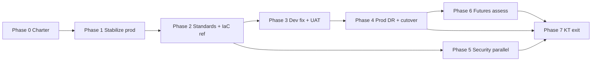

# Strategy: Stabilize RHEL & network (operational uplift)

> **Master scope:** [ENGAGEMENT-ALIGNMENT.md](ENGAGEMENT-ALIGNMENT.md)

**Confirmed:** **No production Linux environments.** **Dev hosts use Podman** (systemd). Laptops may use **WSL2/Ubuntu**. Network/compute **manual** (not client IaC). Path: **dev → UAT → first prod Linux**.

**Engagement fit:** [SOW.md](SOW.md) contract items **1–6** (via [CHARTER-ADDENDUM.md](CHARTER-ADDENDUM.md)): planning, standards, risks, environment recommendations, cutover support, KT. **Not** app remediation, network build, prod deploy, or security/monitoring **implementation** beyond draft standards (SOW scope boundaries).

**Related:** [discovery-workshop-1.md](discovery-workshop-1.md) · [ARCHITECTURE.md](ARCHITECTURE.md) · [AZURE-NETWORK-ARCHITECTURE.md](AZURE-NETWORK-ARCHITECTURE.md)

---

## Strategy in one sentence

**Stabilize dev Podman (Track A) + network documentation (Track B) → standards → UAT Linux → first prod Linux → defer K8s/APIM/golden-image unless chartered.**

---

## Dual workstreams (summary)

| Track | Stabilize | Consultant | Client | Out of scope |
|-------|-----------|------------|--------|--------------|
| **A — RHEL** | Dev Podman reliable; UAT/prod Linux designed | Assess dev, Podman standards, UAT/prod design, reference IaC KT | Dev fixes, UAT/prod build, cutover | App code, licenses, 24×7 ops |
| **B — Network** | Egress, DNS, firewall documented and working | As-built review, allow-list draft, risks | Implement rules, PE, DNS, peering (portal/tickets) | Hub Terraform by consultant |

See [ENGAGEMENT-ALIGNMENT.md](ENGAGEMENT-ALIGNMENT.md) for full in/out of scope tables.

---

## Target end state (12–18 months)

| Pillar | Outcome |
|--------|---------|
| **Stable dev** | RHEL + **Podman** reliable (storage, SELinux, systemd, monitoring) |
| **First prod Linux** | UAT → prod built the **same way** (IaC + CI/CD + registry) |
| **Security baseline** | CIS-aligned OS; FIPS only where client apps approve |
| **Recoverable** | ASR/DR planned for **new** prod Linux VMs |
| **Clear runway** | K8s, APIM, Front Door = **assessed**, not assumed |

---

## Migration model (what this is / is not)

| Label | Applies? |
|-------|----------|
| **Lift-and-shift to Azure** | Mostly **done** (on-prem → Azure RHEL) |
| **Ubuntu → RHEL in prod** | **N/A** — no prod Linux yet |
| **Greenfield prod Linux** | **Yes** — after dev stable + UAT |
| **Operational uplift** | **Yes** — dev Podman first |
| **Podman on RHEL** | **Yes** — confirmed dev standard |
| **Golden image** | **Optional** — for homogeneous UAT/prod VM fleet |
| **AKS / full PaaS replacement** | **Out of default SOW** — assessment only |

---

## When network is not in IaC

The client may operate **hub, spoke, firewall, peering, NSG, DNS, and private endpoints** outside any Terraform/Bicep repo (portal, Firewall Manager, managed service provider, or tickets only). Workshop 1 noted **manual** Azure builds. That is normal and **does not** change this strategy.

### Two parallel backlogs

| Backlog | Owned by | Examples | Consultant role |
|---------|----------|----------|-----------------|
| **Platform IaC** | Client platform | VM, disks, SIG, image pipeline, compute module | Deliver **reference** in this repo; client forks and applies |
| **Network (manual)** | Client network | Peering, UDR, firewall rules, PE, privatelink DNS links | Document **as-built**, draft allow-lists/runbooks; **client implements** |

Do **not** wait for client network Terraform. Do **not** expand reference IaC to recreate their landing zone.

### When discovery finds non-IaC issues

Log each item in the **risk register** and **recommendations** list (see questionnaire finding template). Examples:

- Flat VNet or missing egress control → architecture recommendation; Phase 6 if large  
- Firewall blocks RHSM, Snowflake, or image build → allow-list + **client ticket**  
- CAB delay → process risk; adjust UAT/prod dates  
- Wrong DNS for private endpoint → DNS team action, not a new Terraform module here  

**Blockers** for UAT/image build must have a **network ticket owner** and due date—not a consultant commit to code it in `infra/terraform/`.

### Phase impact

| Phase | Network-not-in-IaC behavior |
|-------|----------------------------|
| 1 Stabilize | Use as-built diagram; fix mount/SELinux on VM (compute, not hub rebuild) |
| 2 Standards | Document **required** network controls for RHEL/Podman; optional “future IaC objects” appendix |
| 5 Security | Workshop 2 + firewall matrix; client applies rules manually |
| 6 Futures | Landing-zone IaC adoption = client initiative; assessment only unless change order |

Full classification: [NETWORK-DISCOVERY-QUESTIONNAIRE.md — When client network is not in IaC](NETWORK-DISCOVERY-QUESTIONNAIRE.md#when-client-network-is-not-in-iac).

---

## Phased plan

### Phase 0 — Align charter (Week 1)

**Goal:** Align SOW wording with reality.

| Action | Owner |
|--------|--------|
| Confirm engagement = **RHEL operational uplift**, not Ubuntu migration | Consultant + client PM |
| Sign RACI (network, platform, app, consultant) | Client PM |
| List in-scope envs (prod, DR, UAT, dev) and freeze windows | Client |

**Exit:** Written charter agreed; [discovery-workshop-1.md](discovery-workshop-1.md) engagement section closed.

---

### Phase 1 — Assess & stabilize (Weeks 1–3)

**Goal:** Assess and stabilize **dev Podman** **and** establish network baseline (parallel tracks).

#### Track A — RHEL / Podman (dev)

| Work | Owner | SOW item |
|------|--------|----------|
| Deep-dive: OS, **Podman**, systemd, mounts, users, integrations | Consultant (access required) | 1 |
| Fix **persistent data disk mount** | Client | Out of scope: consultant execute |
| **SELinux** vs container paths | Client | Out of scope: consultant execute |
| **Logic Monitor** (or agreed agent) | Client | Out of scope: consultant deploy |

#### Track B — Network

| Work | Owner | SOW item |
|------|--------|----------|
| Request **as-built** diagram + egress path | Client network | Client provides |
| **Temporary Entra access** for discovery (PIM eligible `Reader`, guest user, MFA) | Client identity / Client platform | Enables portal inventory — [NETWORK-IAM-STANDARDS.md](NETWORK-IAM-STANDARDS.md) |
| Pre-fill [questionnaire](NETWORK-DISCOVERY-QUESTIONNAIRE.md); list blockers | Consultant | 1, 3 |
| Draft **firewall allow-list** (patch, RHSM, Snowflake, Azure) | Consultant draft | 4 (advisory) |
| Implement rules / PE / DNS | Client network | **Out of scope** for consultant |

**Exit (Track A):** Reboot without manual mount repair; monitoring live.  
**Exit (Track B):** Diagram received; blocker tickets owned with due dates.

---

### Phase 2 — Standards & reference patterns (Weeks 2–6)

**Goal:** “How we run RHEL + Podman on Azure” (SOW item 2).

Document:

- OS: RHSM patching, SSH/admin (Bastion), NTP, audit/logging
- **Podman:** SELinux contexts, volumes, systemd/quadlet, image promotion to registry
- **Developer CLI:** PIM eligible roles on dev sub + `az-developer-login.sh` ([DEVELOPER-AZURE-CLI-ACCESS.md](DEVELOPER-AZURE-CLI-ACCESS.md))
- Azure VM: OS + data disks, identity, backup/ASR
- CI/CD: GitHub Actions path dev → UAT → prod
- Network: recommendations aligned to [AZURE-NETWORK-ARCHITECTURE.md](AZURE-NETWORK-ARCHITECTURE.md) (client implements)

**Deliverables:**

| Artifact | Consultant | Client |
|----------|--------------|--------|
| **RHEL-on-Azure + Podman standards** (draft → approved) — [STANDARDS-RHEL-PODMAN-v0.1.md](STANDARDS-RHEL-PODMAN-v0.1.md) | Author | Approve, maintain |
| **Reference IaC** in this repo | Deliver, KT | Fork, apply in tenant |
| **Risk register** (initial) | Maintain | Mitigate owned risks |

**Golden image pipeline** ([ARCHITECTURE.md](ARCHITECTURE.md)): optional when **UAT + prod** Linux VMs should be homogeneous; dev may stay **Podman + config** until UAT build.

**Exit:** Standards v1.0 approved; reference IaC handoff complete.

---

### Phase 3 — Fix dev, then stand up UAT (Weeks 4–10)

**Goal:** Same runtime model, repeatable build (Workshop 1: dev before UAT before prod).

| Step | Action | Owner |
|------|--------|--------|
| 1 | Decide: keep **WSL2/Ubuntu** for dev vs **RHEL dev VM** | Client |
| 2 | Build **UAT** from standards + client IaC (not manual prod clone) | Client platform |
| 3 | Deploy **same Podman images/config** class as prod; run integration tests | Client app/platform |
| 4 | **Promotion runbook** (scripts + GitHub Actions) | Consultant draft; client executes |

**Exit:** UAT sign-off before prod rebuild or major prod change.

---

### Phase 4 — Prod repeatability & DR (Weeks 8–14)

**Goal:** Prod is rebuildable; DR is proven (SOW item 5 — cutover support in agreed window).

| Work | Notes | Owner |
|------|--------|--------|
| Validate **ASR** with data disk + Podman volume paths | Workshop 2: ASR planned for Linux | Client |
| Choose **in-place harden** vs **parallel VM cutover** | Parallel lower risk for Snowflake/trading deps | Client decides; consultant advises |
| Key Vault / managed identity for secrets | Reduce manual config | Client implements |
| Cutover runbook (network/LB/DNS) | [runbooks/NETWORK-CUTOVER-RUNBOOK.md](runbooks/NETWORK-CUTOVER-RUNBOOK.md) | Consultant draft; client executes |

**Exit:** DR test documented; prod rebuild or cutover runbook approved.

---

### Phase 5 — Security & compliance (Weeks 6–12, parallel)

**Goal:** Bank-appropriate baseline without app remediation scope creep.

| Item | Approach | Owner |
|------|----------|--------|
| CIS / STIG | OpenSCAP **assess** prod; remediate in maintenance windows | Consultant advise; client execute |
| FIPS | **App teams** validate; enable only if approved | Client |
| IAM | Managed identities; no long-lived keys on VM | Client platform |
| Network / egress | Workshop 2 + firewall allow-list | Client network |

See [COMPLIANCE.md](COMPLIANCE.md) (informational only; not audit sign-off).

**Exit:** Assessment report + exception list; network gaps closed or scheduled.

---

### Phase 6 — Optional futures (assessment only)

**Goal:** Recommend / defer / reject — no build without change order.

| Option | Consider when |
|--------|----------------|
| **AKS** | Independent scale/deploy needed; team ready for K8s |
| **APIM + Front Door** | Centralize tokens; separate from OS uplift |
| **SIG / Azure Image Builder** | Fleet of homogeneous RHEL VMs |
| **Container registry + signing** | Supply-chain maturity required |

**Deliverable:** Short assessment memo (effort, deps, recommendation).

---

### Phase 7 — Knowledge transfer & exit (Weeks 12–16)

**Goal:** SOW item 6 — client can operate without consultant.

- Runbooks: [runbooks/OPERATIONS-RUNBOOK.md](runbooks/OPERATIONS-RUNBOOK.md), [runbooks/PROMOTION-RUNBOOK.md](runbooks/PROMOTION-RUNBOOK.md), [runbooks/CUTOVER-RUNBOOK.md](runbooks/CUTOVER-RUNBOOK.md)
- IaC repo ownership and on-call
- Handoff to Linux admin hire (if proceeding)

**Exit:** KT sign-off; support plan documented.

---

## Responsibility summary

| Phase | Consultant | Client |
|-------|-------------------|--------|
| 0–2 | Assess, standards, risks, reference IaC, review diagrams | Access, fixes, monitoring, deploy IaC |
| 3–4 | UAT/prod design, runbooks, cutover **support** | Build envs, CI/CD, execute cutover |
| 5 | Hardening guidance | Remediate OS; app FIPS testing |
| 6 | Assessment memo | Funding / change order |
| 7 | KT | Operate long-term |

---

## First 30 days

| # | Action | Owner |
|---|--------|--------|
| 1 | Charter email (post-RHEL uplift scope) | Consultant |
| 2 | Linux box access + architecture diagram | Client |
| 3 | Dev Podman assessment report (mount, SELinux, DR) | Consultant |
| 4 | RHEL-on-Azure + Podman standards v0.1 | Consultant |
| 5 | UAT design (IaC modules, promotion path) | Consultant |
| 6 | Network Workshop 2 (if external egress critical) | Consultant + client network |

Track in [CLICKUP-DISCOVERY-TICKETS.md](CLICKUP-DISCOVERY-TICKETS.md).

---

## What not to lead with

- In-place **prod Linux** hardening (no prod Linux exists)  
- Consultant **terraform apply** in client prod  
- Treating dev as **Docker** (client standard is **Podman**)  
- Hub–spoke greenfield as consultant build  
- AKS or APIM implementation in v1 without change order  

---

## Diagram: phase flow

---

## Document history

| Version | Date | Author | Notes |
|---------|------|--------|-------|
| 1.0 | _[date]_ | _[name]_ | Initial strategy post Workshop 1 |
