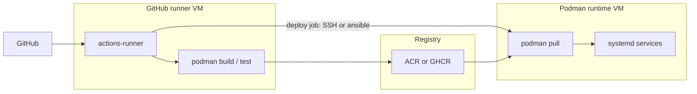
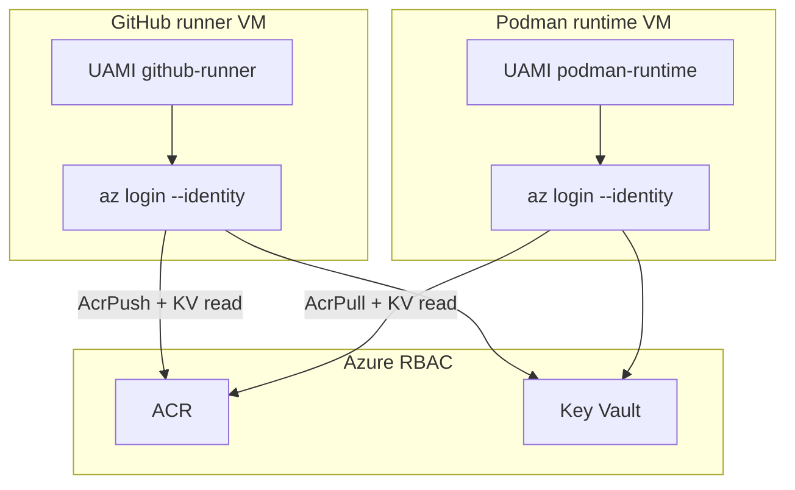

# VM design considerations (client-specific)

> **Context:** [ENGAGEMENT-ALIGNMENT.md](ENGAGEMENT-ALIGNMENT.md) — **SOW items 2 and 4** (standards + environment improvement). **No prod Linux today**; **dev = Podman**; target path **dev → UAT → prod**. This outline supports **UAT/prod Linux VM design** and **dev host remediation**. **Client builds** VMs; consultant advises.

**Related:** [discovery-workshop-2.md](discovery-workshop-2.md) · [ARCHITECTURE.md](ARCHITECTURE.md) · [AZURE-NETWORK-ARCHITECTURE.md](AZURE-NETWORK-ARCHITECTURE.md) · reference module `infra/terraform/modules/compute-linux/`

---

## 1. VM role and environment

### 1.1 Recommended topology: split GitHub Actions runner from Podman runtime

**Decision:** Use **two VMs per environment** (dev / UAT / prod)—do **not** co-locate the **GitHub self-hosted runner** with Podman workload hosts.

| VM role | Purpose | Must not run |
|---------|---------|--------------|
| **Podman runtime VM** | Long-lived services: FastAPI microservices, Dagster, ingestion staging, `systemd`/quadlet | `actions-runner`, `podman build`, compile toolchains, CI job execution |
| **GitHub runner VM** | CI/CD only: clone, test, **build image**, push to registry, trigger deploy to runtime VM | Application containers, Dagster daemon, ingestion data paths |



**Why split**

| Risk on combined host | Split mitigates |
|----------------------|-----------------|
| CI spikes steal CPU/RAM from APIs and Dagster | Independent SKU sizing |
| Compromise of runner (untrusted job code) exposes runtime secrets | Blast radius isolation |
| `podman build` + dev packages on prod runtime | Runtime stays **pull-only** |
| Pen test / hardening scope blurred | Runner = build zone; runtime = production zone |

### 1.2 Environment matrix

| Consideration | Dev (today) | UAT (next) | Prod (first Linux) |
|---------------|-------------|------------|---------------------|
| **Podman runtime VM** | Stabilize existing services; **remove runner** when split VM exists | Prod-like runtime; validate deploy from runner | Snowflake data platform runtime, APIs, orchestration |
| **GitHub runner VM** | Document current runner placement; plan migration off runtime host | Same runner pattern as prod; may share dev runner initially | Dedicated runner; **no** app workloads |
| **Subscription** | Dev tenant/sub | Dev or dedicated UAT RG | **Prod subscription** (separate from dev) |
| **Parity** | Source of truth to **document** | **Two VMs** + same Podman + systemd deploy as prod | Same **images** and deploy mechanism as UAT |
| **Count** | 1+ hosts today (often combined) | **2 VMs** minimum per env | **2 VMs** minimum; scale runtime only if workload grows |

**Still open:** Single runtime VM vs split ingestion vs API on **runtime** tier only—runner stays separate either way.

---

## 2. Workload profile (drives size & disk)

From discovery, the VM must support:

| Workload | VM | Implication |
|----------|-----|-------------|
| **Podman** containers (FastAPI / microservices) | **Runtime** | CPU + RAM for concurrent services; **systemd** or quadlet per service |
| **Dagster** orchestration | **Runtime** | CPU spikes during runs; confirm co-location with APIs on same runtime host |
| **GitHub Actions runner** (CI jobs) | **Runner only** | Size for **parallel jobs** + build cache; bursty CPU; **never** on runtime VM |
| **Image build** (`podman build`) | **Runner only** | Build tools, caches, test deps live here—not on UAT/prod runtime |
| **SFTP / file ingestion** → Snowflake path | **Runtime** | **Data disk** for staging; IOPS for file churn |
| **Snowflake / external DB** connectivity | **Egress** heavy; no assumption of private link unless client provides |
| **Charles River / trading APIs** | Low-latency egress; document endpoints for firewall allow-list |
| **Retool / Power BI** | Mostly SaaS—VM may not host; verify no UI on VM |

**Sizing:** Start assessment from **current dev utilization** (`top`, `podman stats`, disk usage) before UAT/prod SKU.

---

## 3. Operating system

| Item | Recommendation | Client action |
|------|----------------|---------------|
| **OS** | **RHEL 9.x** (align with dev and RH support) | RHSM / Satellite |
| **Container runtime** | **Podman** (not Docker)—client standard | `podman`, `podman-compose` or quadlet |
| **Init** | **systemd** for service lifecycle + reboot persistence | Unit files in git |
| **Package baseline** | Minimal + audit, chrony, rsyslog, sssd (if Entra/AD) | Standards doc |
| **Marketplace image** | RHEL BYOS or golden SIG if fleet grows | Licensing |
| **Patching** | `dnf update --security`; maintenance windows | Client ops |

**Avoid:** Mixing Docker and Podman on same host without reason.

---

## 4. Compute (SKU)

Size **each role independently** from dev metrics.

### Podman runtime VM

| Factor | Guidance |
|--------|----------|
| **vCPU** | Concurrent Podman services + Dagster peaks only—**exclude** CI |
| **RAM** | Container sum + OS + Dagster; add 25–30% headroom |
| **SKU family** | **Dsv5** or **Esv5**; **E** if large in-memory work on VM |
| **Burstable (B-series)** | **Avoid** for UAT/prod runtime |

### GitHub runner VM

| Factor | Guidance |
|--------|----------|
| **vCPU** | Peak **concurrent jobs** × cores per job (often 2–4 per job); measure from current runner |
| **RAM** | Largest build/test job + parallel job count; builds are often RAM-bound |
| **Disk** | Larger **OS disk** or ephemeral cache for layer/build artifacts; prune policy required |
| **SKU family** | **Dsv5** (CPU-heavy builds) or **Fsv2** if compile-heavy; still **avoid B-series** for prod runner |
| **Count** | One runner VM per env to start; add second runner VM only if job queue SLA requires |

| Shared | Guidance |
|--------|----------|
| **Accelerated networking** | Enable if supported and traffic warrants |
| **Gen2** | Required for Trusted Launch |

**Action:** Export **runtime** and **runner** metrics separately for 2 weeks before locking UAT/prod SKUs.

---

## 5. Storage (critical — prior mount failures)

Use **both** patterns where needed: **Managed Disk** (VM-local block) + optional **Azure File Share** (shared files).

| Type | Azure service | Reference module | Primary use |
|------|---------------|------------------|-------------|
| **Managed Disk** | Managed Disk attached to VM | `compute-linux` `data_disks` | Podman volumes, **local** ingestion staging, high IOPS |
| **File Share** | Azure Files (NFS or SMB) | `storage-fileshare` | **Shared** ingestion drop, multi-consumer files, hybrid access |

### Podman runtime VM

| Disk / share | Purpose | Considerations |
|--------------|---------|----------------|
| **OS disk** | `/`, `/var` (unless data disk used for Podman) | Premium SSD for prod; **64–128 GB** minimum |
| **Managed data disk** | Ingestion staging, app data, Podman volumes | **Premium_LRS**; separate LUN; mount via **UUID in fstab** or cloud-init — `compute-linux` `data_disks` |
| **Azure File Share** (optional) | Shared landing zone when multiple systems need same files | **NFS** on RHEL (Premium FileStorage); private endpoint; runtime UAMI `Storage File Data Privileged Contributor`; mount at layer 2 via `/opt/compliance/bootstrap/mount-azure-fileshare.sh` |

**Default:** managed data disk for runtime. Add file share when discovery confirms shared ingestion or off-VM producers.

### GitHub runner VM

| Disk | Purpose | Considerations |
|------|---------|----------------|
| **OS disk** | Runner install, job workspaces, build cache | **128–256 GB** typical; aggressive cleanup (`podman system prune`, Actions workspace cleanup) |
| **Managed data disk** | Optional | Build cache or large fixtures only — not app ingestion |
| **File Share** | Usually **not** needed | Runner uses local disk + registry |

### Shared (both VMs)

| Item | Considerations |
|------|----------------|
| **Persistence** | Survive reboot—**lesson from dev:** improper mount caused data loss; automate in IaC/cloud-init |
| **Encryption** | Managed Disk + Files: Azure SSE at rest; CMK if policy requires |
| **Backup** | Managed data disk in ASR/Backup; file share via share snapshot / backup policy |
| **Network** | File share: private endpoint to `privatelink.file.core.windows.net`; egress from VM subnet |

| Anti-pattern | Fix |
|--------------|-----|
| Manual mount after reboot | `fstab` + `systemd` mount units + cloud-init on first boot |
| Podman volumes on OS disk only | Dedicated **managed data disk** for `/var/lib/containers` or named volumes path |
| Storage account keys on VM | **UAMI** RBAC to file share; avoid account keys in fstab |

### Reference Terraform (runtime VM)

```hcl
module "podman_runtime" {
  source = "../../modules/compute-linux"
  # ...
  data_disks = [{
    name                 = "vm-prod-runtime-data01"
    size_gb              = 256
    storage_account_type = "Premium_LRS"
    lun                  = 0
    mount_hint           = "/var/lib/containers"
  }]
}

module "ingestion_share" {
  source = "../../modules/storage-fileshare"
  # ...
  share_protocol   = "NFS"
  principal_ids    = [azurerm_user_assigned_identity.runtime.principal_id]
}
```

---

## 6. Identity and access

### 6.1 Human access (both VMs)

| Item | Dev issue | Target for UAT/prod |
|------|-----------|---------------------|
| **Shared admin** | All developers one account | **Per-user** Linux accounts or **Entra ID SSH** (Patrick/Kirk pilot) |
| **SSH** | Direct login | **Bastion** or Entra SSH; **no** shared keys |
| **Sudo** | Uncontrolled | `sudo` via group; logged (auditd) |
| **Break-glass** | — | Documented; disabled by default |

**VM admin user:** Dedicated Linux account for automation; no day-to-day human shared login.

### 6.2 Azure managed identity + Azure CLI (both VMs)

Azure has **no** built-in “VM role” that enables Azure CLI. **Both** the GitHub runner VM and the Podman runtime VM use the same platform pattern:

1. **User-assigned managed identity (UAMI)** attached to the VM at build (see `compute-linux` module `identity` block).
2. **`azure-cli`** installed in baseline (Ansible/cloud-init) on **both** hosts.
3. **`az login --identity`** (or `-u <uami-resource-id>` for user-assigned) — no client secret on disk.
4. **Azure RBAC** role assignments on each UAMI principal — **different roles per VM**, least privilege.



**Naming (per environment):** e.g. `uami-{env}-github-runner`, `uami-{env}-podman-runtime` — **one UAMI per VM**; do not share a single identity across both roles.

| Capability | GitHub runner UAMI | Podman runtime UAMI |
|------------|-------------------|---------------------|
| **Azure RBAC: `AcrPush`** | Yes — push built images | **No** |
| **Azure RBAC: `AcrPull`** | Optional (if job pulls base images) | Yes — deploy-time pull |
| **Azure RBAC: `Key Vault Secrets User`** | Yes — deploy/CI secrets | Yes — app/runtime secrets |
| **Azure RBAC: `Storage Blob Data *`** | Only if pipeline reads/writes blobs | Only if ingestion uses blob |
| **`Contributor` / broad RG write** | **No** | **No** |
| **`az` on host** | Yes — registry login, KV, deploy automation | Yes — **pull-only** operations; avoid general ARM changes |

**On-VM usage (examples):**

```bash
# Runner — after image build
az login --identity -u "$RUNNER_UAMI_ID"
az acr login --name <acr>
podman push <acr>.azurecr.io/app:${GIT_SHA}

# Runtime — deploy or systemd ExecStartPre
az login --identity -u "$RUNTIME_UAMI_ID"
az acr login --name <acr>
podman pull <acr>.azurecr.io/app:${TAG}
```

**IMDS:** Managed identity tokens use the instance metadata endpoint (`169.254.169.254`). Do **not** block this on the VM — it is local to the host.

**CI/CD deploy:** Prefer **managed identity** (runner UAMI or GitHub OIDC) over stored service principal secrets. Human SSH to prod for deploy is not the target state.

**GitHub OIDC (complement to runner UAMI):** Workflows may use `azure/login@v2` with federated credentials instead of relying solely on VM MI for every job — client chooses one primary pattern; runtime still uses **runtime UAMI** for pull.

| Item | Owner |
|------|--------|
| Create UAMI + attach to VM | Client platform (Terraform/Bicep) |
| RBAC role assignments per UAMI | Client platform / IAM |
| Install `azure-cli` + document UAMI IDs in cloud-init | Client platform + standards doc |

---

## 7. Azure VM platform

| Item | Recommendation |
|------|----------------|
| **Trusted Launch** | `secure_boot_enabled`, `vtpm_enabled` (see `compute-linux` module) |
| **Managed identity** | **User-assigned UAMI per VM** — runner and runtime each get a dedicated identity (§6.2) |
| **Patch mode** | `ImageDefault` or `AutomaticByPlatform` per policy |
| **Availability** | Prod: consider **Availability Zone** if SLA requires |
| **Proximity** | Same region as Snowflake/Azure data services where possible |
| **Tags** | Environment, owner, cost center, compliance scope, `Role=github-runner` or `Role=podman-runtime` |
| **Boot diagnostics** | Enabled for break-fix |

---

## 8. Networking

### Podman runtime VM

| Item | Consideration |
|------|----------------|
| **Subnet** | App/data tier; **no** public IP on prod if policy allows |
| **NSG inbound** | Bastion; APIM or internal consumers only—**no** runner SSH from internet |
| **NSG egress** | Snowflake, RHSM, ACR/GHCR (**pull**), SFTP peers, Charles River APIs; **Azure control plane**; **Azure Files** private endpoint if share used |
| **Private IP** | **Static** if firewalls whitelist IP |
| **APIM** | Edge auth may front services—runtime accepts traffic from APIM subnet only |

### GitHub runner VM

| Item | Consideration |
|------|----------------|
| **Subnet** | **CI/build tier**—separate subnet or NSG from runtime if policy allows |
| **NSG inbound** | Bastion; runner polls GitHub outbound-only (no inbound from GitHub required for standard self-hosted runner) |
| **NSG egress** | **GitHub** (`github.com`, `api.github.com`, `codeload.github.com`, `objects.githubusercontent.com`), **registry push** (ACR/GHCR), RHSM, package mirrors; **Azure control plane** (`login.microsoftonline.com`, `management.azure.com`) for runner UAMI / `az acr login` |
| **To runtime VM** | Deploy job: **SSH** (key in Key Vault), **Ansible**, or **pull-only** (runtime pulls; runner only signals restart)—document one pattern |
| **Not required on runtime** | GitHub API egress if runtime never runs CI |

| Shared | Consideration |
|--------|----------------|
| **DNS** | Client resolver (on-prem AD forwarder or Azure DNS private resolver) |
| **Hybrid** | Head data center paths—document in network requirements |
| **Network not in IaC** | Client implements peering/NSG/firewall via tickets |

Reference: [NETWORK-DISCOVERY-QUESTIONNAIRE.md](NETWORK-DISCOVERY-QUESTIONNAIRE.md), [AZURE-NETWORK-ARCHITECTURE.md](AZURE-NETWORK-ARCHITECTURE.md).

---

## 9. Podman / container operations

| Item | Consideration |
|------|----------------|
| **Rootful vs rootless** | Document dev choice; prod often rootful with SELinux policies or hardened rootless |
| **SELinux** | **Mandatory** policy for container paths (`:z`, `:Z`, custom booleans)—fix dev conflicts before replicate |
| **Images** | **Registry** (ACR vs GHCR)—no `podman build` on prod server |
| **ACR auth (runtime)** | **Runtime UAMI** + `az acr login --identity` or equivalent; `AcrPull` only |
| **Deploy** | CI pushes image → runtime pulls via UAMI → `systemd` restart; **no manual** deploy |
| **Secrets** | Key Vault + **runtime UAMI** (`Key Vault Secrets User`); not in git or world-readable env files |
| **Logging** | Container logs → journald (capped, rate-limited) → rsyslog; logrotate + `/var/log/archive`; audit-forward log for SIEM |
| **Resource limits** | `podman run --cpus --memory` or systemd `MemoryMax` |

**Walkthrough required:** build → store → deploy (document current vs target).

---

## 10. Security and compliance

| Item | Source | Action |
|------|--------|--------|
| **Pen test / Arctic Wolf** | Workshop 2 / Kirk | **P0 closed on dev** before UAT; **re-scan** before prod — see [STANDARDS-RHEL-PODMAN-v0.1.md](STANDARDS-RHEL-PODMAN-v0.1.md) §5 gates |
| **CIS RHEL 9 L1** | Standards (primary) | OpenSCAP in AIB; verify artifacts |
| **DISA STIG** | GRC only if mandated | Separate OpenSCAP profile — not default; app compatibility test required |
| **FIPS** | Discussed | Only if apps approved—**app team** tests |
| **auditd** | Baseline | Identity, sudo, execve, Podman; audisp syslog + archive retention |
| **dnf-automatic** | Baseline | Security-only updates; reboot deferred to change window |
| **AIDE / EDR** | Bank norm | Per client SOC (Logic Monitor + EDR) |
| **No secrets on disk** | — | KV references only |

---

## 11. CI/CD integration (GitHub Actions → registry → Podman runtime)

| Step | Where | Pattern |
|------|-------|---------|
| **1. Trigger** | GitHub | Workflow on push/PR/tag; branch protection for UAT/prod |
| **2. Test / build** | **Runner VM** | Job `runs-on: [self-hosted, rhel, uat]`; workflow steps run `podman build` / tests on runner host |
| **3. Push** | **Runner VM** → registry | Tag `app:git-sha`; **runner UAMI** `az acr login --identity` + `podman push`; or GHCR via `GITHUB_TOKEN` |
| **4. Deploy** | **Runner VM** → **Runtime VM** | **Preferred:** trigger runtime pull via **runtime UAMI** (systemd/`ExecStartPre`) or SSH/Ansible — runtime does **not** build |
| **5. Promote** | GitHub Environments | dev → UAT → prod; **required reviewers** on prod environment |
| **Secrets** | Key Vault + UAMI / GitHub OIDC | No SP passwords on either VM; Snowflake creds via KV + runtime UAMI |

| Item | Consideration |
|------|----------------|
| **Runner registration** | Org- or repo-level self-hosted runner; **one runner VM per env** with labels (`dev`, `uat`, `prod`) |
| **Runner service** | `actions-runner` under `systemd`; pin runner version in standards; auto-update policy per security |
| **Runner UAMI** | `AcrPush`, `Key Vault Secrets User`; `azure-cli` installed; document UAMI ID in `/etc/environment` or cloud-init |
| **Runtime UAMI** | `AcrPull`, `Key Vault Secrets User` only; `azure-cli` for `az acr login` — **no** `AcrPush` |
| **GitHub OIDC** | Optional `azure/login@v2` in workflow (federated credential) — use **instead of or with** runner UAMI; runtime still uses runtime UAMI |
| **Concurrency** | Workflow `concurrency:` + job limits ≤ vCPU budget; avoid parallel builds starving deploy jobs |
| **Untrusted code** | Runner VM is **lower trust** — runner UAMI must **not** inherit runtime RBAC or `Contributor` |
| **IaC** | Client Terraform/Bicep: **two UAMIs**, two VMs, RBAC assignments per §6.2 |
| **Config in git** | `.github/workflows/*.yml`, systemd units, quadlet on **runtime** (not secrets) |

---

## 12. Monitoring and operations

| Item | Consideration |
|------|----------------|
| **Azure Monitor** | Banking baseline: Layer 1 golden image installs rsyslog fragment + AMA prereqs; Layer 2 `monitor-baseline` module attaches DCR (syslog + perf) and `AzureMonitorLinuxAgent` to **both** VMs → client Log Analytics / Sentinel |
| **Logic Monitor** | Patrick—OS, disk, Podman, systemd failed units (separate from Azure Monitor; both may coexist) |
| **Alerts** | Disk full (ingestion), service down, high CPU |
| **Log forwarding** | Azure Monitor DCR → Log Analytics; SIEM rules client-owned |
| **Runbooks** | Restart service, disk full, failed deploy rollback |
| **On-call** | Client Linux admin / platform |

---

## 13. DR and business continuity

| Item | Consideration |
|------|----------------|
| **ASR** | Client plans ASR for Linux—include **data disk** and **Podman volume paths** |
| **RPO/RTO** | Define with business before prod |
| **Rebuild** | VM + cloud-init + pull images + restore data disk |
| **Region** | DR region replication if required |

---

## 14. Licensing and support

| Item | Owner |
|------|--------|
| **RHEL subscriptions** | Client procurement |
| **RHSM / Satellite** | Register at build; network path to Red Hat |
| **Azure compute cost** | Finance chargeback tags |

---

## 15. Build methods (layered model)

Industry-standard approach for this client: **base golden image (OS only)** → **role bootstrap** → **workload orchestration**. See [ARCHITECTURE.md](ARCHITECTURE.md) layering table.

| Layer | What | Includes | Excludes |
|-------|------|----------|----------|
| **1 — Golden image (SIG/AIB)** | Shared RHEL 9 base for runner + runtime VMs | CIS hardening, monitoring agent, `azure-cli`, auditd, SELinux, chrony, compliance artifacts | FastAPI, Dagster, ingestion services, Podman **app** containers, `actions-runner`, secrets, UAMI/RBAC assignment |
| **2 — Role bootstrap** | cloud-init / Ansible on first boot | **Runner:** `actions-runner`, build deps, UAMI attach. **Runtime:** Podman engine, data disk, **Quadlet** stack (api + nginx sidecar templates) | Running app containers, prod data |
| **3 — Workload orchestration** | GitHub Actions + systemd | Pull images, start Dagster/FastAPI/ingestion via systemd/quadlet, KV secrets | OS baseline changes |

| Path | When | Notes |
|------|------|-------|
| **A — IaC VM from marketplace + cloud-init/Ansible** | **Default** if single/few VMs | Layers 2–3 without SIG; layer 1 = marketplace RHEL + Ansible hardening |
| **B — IaC VM from SIG base + role bootstrap** | **Recommended** when fleet or audit wants versioned OS | Terraform three-layer reference — see below |
| **C — Clone dev VM** | Never for UAT/prod | Carries shared admin, manual mounts, pen test debt |

### Three-layer Terraform (reference)

| Layer | Apply path | Delivers |
|-------|------------|----------|
| **1** | `infra/terraform/environments/prod/` (layer1-image-pipeline) | SIG golden image: CIS, `azure-cli`, **Python/pip/venv/Ansible**, Azure Monitor prereqs + Logic Monitor stubs |
| **2** | `infra/terraform/environments/workload/` | Runner + runtime VMs, UAMI, **monitor-baseline** (DCR + AMA), data disk, optional file share; cloud-init runs layer-2 Ansible |
| **3** | GitHub Actions (client) | `podman pull`, systemd/quadlet services — `layer3_handoff` output in workload stack |

**Recommended sequence:** Stabilize **dev** → **layer 1** SIG build → **layer 2** UAT VMs → **layer 3** CI validation → **prod**.

**One SIG image, two VM roles:** Same golden image for GitHub runner and Podman runtime; cloud-init calls `/opt/compliance/bootstrap/run-layer2-ansible.sh <role>`; UAMI RBAC per §6.2.

---

## 16. Pre-build checklist (UAT / prod)

Client platform completes before first boot (**both VMs**):

- [ ] Subscription and RG chosen (dev vs prod sub)
- [ ] **Two subnets/NSGs** (or one subnet with distinct NSGs): runtime vs runner
- [ ] Firewall allow-list: runtime vs runner egress (GitHub, registry, **Azure control plane** for UAMI)
- [ ] SKU sized **separately** from dev runtime vs runner metrics
- [ ] **Runtime:** OS + **managed data disk** (`data_disks`); fstab/cloud-init tested on UAT
- [ ] **Optional:** Azure File Share provisioned (`storage-fileshare`); NFS mount tested if shared ingestion
- [ ] **Runner:** disk sized for build cache; prune policy documented
- [ ] RHEL registered (RHSM) on both
- [ ] Entra SSH or per-user access model
- [ ] **Two UAMIs** created and attached (runner + runtime); RBAC per §6.2 (`AcrPush` / `AcrPull`, KV Secrets User)
- [ ] **`azure-cli`** installed on **both** VMs; `az login --identity` validated (ACR login smoke test)
- [ ] Runner UAMI: push to registry; runtime UAMI: pull only — **no** shared identity, **no** `Contributor`
- [ ] GitHub self-hosted runner registered; deploy workflow tested against UAT runtime
- [ ] **Runner removed** from legacy combined dev host (or decommission path documented)
- [ ] Pen test **open P0s** addressed on both roles
- [ ] Azure Monitor: `log_analytics_workspace_id` in workload tfvars; DCR + AMA on both VMs; egress allow-list for `*.ods.opinsights.azure.com`
- [ ] Logic Monitor collector enabled (Patrick) if required alongside Azure Monitor
- [ ] Monitoring + alerts (runner: queue depth, disk; runtime: services, ingestion disk)
- [ ] ASR / backup (**runtime** includes data disk; runner often rebuild-from-IaC acceptable)
- [ ] Runbooks: deploy, rollback, runner disk full, failed job isolation

---

## 17. Consultant vs client

| Activity | Vaco | Client |
|----------|------|--------|
| VM sizing / disk / Podman standards | **Draft** | Approve |
| Network requirements / allow-list | **Draft** | Implement |
| Terraform apply | **Out of scope** | Platform |
| Podman walkthrough + dev assessment | **Lead** | Anatoliy |
| Pen test remediation | Advise priority | Security executes |
| UAT/prod build | Support | Platform |

---

## 18. Open inputs still needed

| Input | From |
|-------|------|
| Dev **Podman** metrics (CPU/RAM/disk) | Assessment on Linux VM |
| **build → store → deploy** walkthrough | Anatoliy |
| **Pen test** summary for Linux | Kirk / security |
| **Azure Reader** + diagram | Patrick / Anatoliy |
| **Registry** choice (ACR vs GHCR) | Client |
| **UAMI + RBAC** assignment model (scope per env) | Patrick / platform |
| **APIM** in front of VM or direct | Anatoliy — [INGRESS-DECISION-NGINX-SIDECAR.md](INGRESS-DECISION-NGINX-SIDECAR.md) |

---

## Industry references

Full map: [INDUSTRY-REFERENCES.md](INDUSTRY-REFERENCES.md)

| Topic | Source |
|-------|--------|
| VM security | [MCSB compute](https://learn.microsoft.com/en-us/security/benchmark/azure/security-controls-v3-compute-security) · [Trusted Launch](https://learn.microsoft.com/en-us/azure/virtual-machines/trusted-launch) |
| Landing zone | [Azure CAF Landing Zone](https://learn.microsoft.com/en-us/azure/cloud-adoption-framework/ready/landing-zone/) |
| Identity on VMs | [Managed identities](https://learn.microsoft.com/en-us/entra/identity/managed-identities-azure-resources/overview) |
| CI/CD runners | [GitHub self-hosted runners](https://docs.github.com/en/actions/hosting-your-own-runners/about-self-hosted-runners) |
| Containers | [NIST SP 800-190](https://csrc.nist.gov/publications/detail/sp/800-190/final) · [Podman Quadlet](https://docs.podman.io/en/latest/markdown/podman-systemd.unit.5.html) |
| DR | [Azure Site Recovery](https://learn.microsoft.com/en-us/azure/site-recovery/site-recovery-overview) |
| OS baseline | [CIS RHEL 9](https://www.cisecurity.org/benchmark/red_hat_linux) |

---

## Document history

| Version | Date | Notes |
|---------|------|-------|
| 0.1 | _[date]_ | Initial outline post-discovery |
| 0.2 | 2026-05-28 | Split **GitHub runner VM** from **Podman runtime VM** |
| 0.3 | 2026-05-28 | **UAMI + Azure CLI + RBAC** on both VMs (§6.2) |
