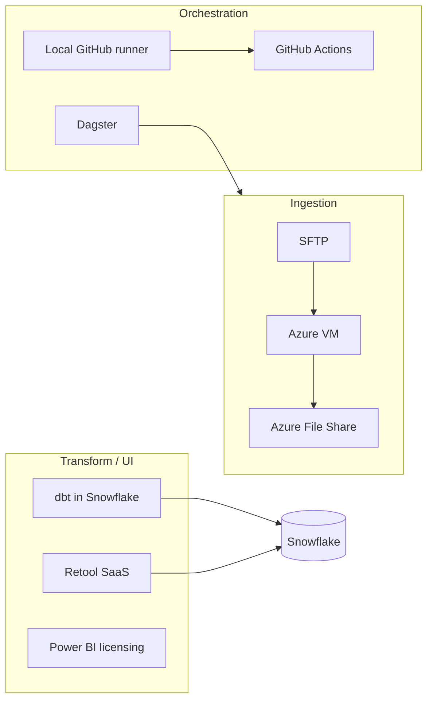

# Discovery Workshop 2 — Summary

| Field | Value |
|-------|--------|
| **Date** | _[add]_ |
| **Goal** | High-level walkthrough of tech stack architecture (Anatoliy) |
| **Attendees** | Anatoliy, Tim, Patrick (partial), Kirk, Letron |
| **Facilitator / consultant** | Tim (Vaco) |
| **Related** | [SOW.md](SOW.md) · [CHARTER-ADDENDUM.md](CHARTER-ADDENDUM.md) · [discovery-workshop-1.md](discovery-workshop-1.md) · [ENGAGEMENT-ALIGNMENT.md](ENGAGEMENT-ALIGNMENT.md) · [CLARIFICATIONS-WITH-DEV-TEAM.md](CLARIFICATIONS-WITH-DEV-TEAM.md) |

---

## Confirmed environment (supersedes Workshop 1)

| Topic | Workshop 1 (incorrect) | **Confirmed** |
|-------|------------------------|---------------|
| **Production Linux** | RHEL on Azure in prod | **None** — no production Linux environments |
| **Dev Linux** | RHEL + Docker implied | **All dev hosts use Podman** |
| **Path** | Stabilize prod | **Stabilize dev → UAT → prod** (greenfield prod Linux) |
| **Orchestrator** | Dagster | Dagster (unchanged) |
| **Deploy** | — | Images built locally; deploy **not automated** — standards priority |
| **Network discovery** | Not covered | Hybrid: Azure subs + **head data center** + Snowflake | Track B: update diagram on-prem vs cloud |
| **Access** | Tim needs Linux access | **Shared admin** on Linux; **Entra SSH** pilot (Patrick partial success) | P0 security + access model |

**Engagement model:** **stabilize and automate DEV Linux (Podman) → replicate pattern to UAT → then first PROD Linux environments.**

---

## Scope legend

| Tag | Meaning |
|-----|---------|
| **In scope** | Consultant documents, advises, standards, risks |
| **Client** | Executes changes |
| **Advisory** | Recommend; client implements |
| **Out of scope** | App remediation, pen test execution, APIM build, network build |

---

## Decisions (agreed in session)

| # | Decision | Scope | Owner |
|---|----------|--------|--------|
| W2-D1 | Replicate **dev** setup to **UAT and prod** after review | In scope plan | Client + consultant |
| W2-D2 | Move toward **Azure API Management** for token validation/routing | **Out of scope** build; advisory | Anatoliy / platform |
| W2-D3 | **Segregate** developer/admin access (personal or **Entra** accounts) | Advisory + client | Anatoliy, Patrick, Kirk |
| W2-D4 | **Repeatable** deploy via scripts / **Terraform / Ansible** | Advisory standards; client IaC | Client platform |
| W2-D5 | Share **architecture diagram PDF**; docs in **ClickUp** | Client provides | Anatoliy |

---

## Open questions (tagged)

| # | Question | Scope | Owner |
|---|----------|--------|--------|
| W2-Q1 | **NGINX** vs **APIM** for routing/SSL | Advisory — [INGRESS-DECISION-NGINX-SIDECAR.md](INGRESS-DECISION-NGINX-SIDECAR.md) | Anatoliy |
| W2-Q2 | Container registry: **GitHub** vs **Azure (ACR)** | Advisory | Anatoliy + Tim |
| W2-Q3 | Dev access: **direct SSH** vs **CI/CD only** | Client decision | Anatoliy |
| W2-Q4 | IaC tool: **Terraform vs Bicep** vs Ansible-only | Advisory | Client platform |
| W2-Q5 | **Monitoring/logging/notifications** (OS + process) | Client deploy | Patrick |
| W2-Q6 | **Pen test / Arctic Wolf** findings → remediation docs | Client remediate; consultant may advise prioritization | Kirk / client security |
| W2-Q7 | **External collaborator** doc access (ClickUp, Vaco) | Client | Letron |
| W2-Q8 | Diagram: **cloud vs on-prem** components | Client | Anatoliy |
| W2-Q9 | **Podman vs Docker** standard for prod path | **Closed — Podman** (all dev hosts) | — |

---

## Architecture (as described)

### Cloud & hybrid

- **Azure:** Separate **prod** and **dev** subscriptions.
- **SAM services/VMs** in Azure (details TBD in PDF diagram).
- **Snowflake** account in Azure.
- **Head data center:** Several **production servers** managed by **another company** (not full cloud).
- Most new components in cloud; legacy/on-prem still in path.

### Data platform pipeline

- **Dagster:** Event-driven orchestration; metadata/events local for security.
- **dbt:** Transformations inside Snowflake; GitHub for deploy.
- **Retool:** Low-code UI → Snowflake (SaaS-to-SaaS).
- **Power BI:** Licensing in progress.

### Linux / containers (dev focus)

- **No prod Linux VM yet** — dev environment under review first.
- **Local GitHub runner** for CI needing local resources.
- **Containers:** Built **locally**; **not fully automated** deploy; partial remote registry push.
- **Podman + systemd** discussed for auto-restart (vs Docker-only in W1).
- **Shared admin account** on Linux — must change (Entra SSH explored).

### API / edge

- **APIM** initiative: token validation centralized (e.g. **Gorobi** route); remove per-service token code.
- **NGINX** role vs APIM still **uncertain**.

### Trading

- **Charles River API** for programmatic trading.
- **Citrix** for trader access.

### Security

- **Pen test** + **Arctic Wolf** findings on Linux — need remediation (**client**).
- Parts of proposed infra **still in test** — not fully approved.

---

## Gaps still open (Track B network)

Workshop 2 added hybrid context but **did not** close [NETWORK-DISCOVERY-QUESTIONNAIRE.md](NETWORK-DISCOVERY-QUESTIONNAIRE.md):

- Firewall egress matrix for dev VM → Snowflake, GitHub, SFTP, Charles River
- On-prem ↔ Azure connectivity for head data center
- Private endpoints / public IP posture

**Next:** Dedicated **network session** with Patrick + network owner + PDF diagram review.

---

## Risk register (additions)

| ID | Risk | Owner |
|----|------|--------|
| R-W2-1 | ~~W1/W2 contradiction~~ | **Closed** — no prod Linux; dev = Podman |
| R-W2-2 | **Shared admin** on Linux | Anatoliy / Patrick |
| R-W2-3 | **No automated** container deploy/registry | Anatoliy |
| R-W2-4 | **Pen test** findings open | Client security |
| R-W2-5 | **Hybrid** dependencies (data center vendor) | Anatoliy |
| R-W2-6 | APIM/NGINX **undecided** — scope creep if bundled with Linux uplift | Tim — charter |

---

## Follow-up actions

| Priority | Action | Owner |
|----------|--------|--------|
| P0 | ~~Confirm prod Linux~~ | **Done** — no prod; dev = Podman |
| P0 | **PDF architecture diagram** in ClickUp | Anatoliy |
| P0 | Tim: **Linux VM access** | **Done** |
| P0 | Tim: **Azure subscription Reader** (dev + prod subs) | Patrick / platform — **pending** |
| P0 | Tim: **walkthrough** container build/store/deploy with Anatoliy | Tim + Anatoliy |
| P1 | Entra SSH: Kirk/Patrick resolve **permissions** | Client |
| P1 | Document **pen test / Arctic Wolf** summary for prioritization (not full remediate by Vaco) | Client → consultant review |
| P1 | Decide **ACR vs GHCR** + automated deploy target state | Advisory |
| P2 | Ingress decision + APIM path — [INGRESS-DECISION-NGINX-SIDECAR.md](INGRESS-DECISION-NGINX-SIDECAR.md); APIM build separate CO | Advisory doc **done**; APIM build out of scope unless CO |

---

## Raw meeting notes (reference)

Expand

- Azure prod/dev subs; SAM VMs; Snowflake in Azure; head DC servers (other company).
- Dagster orchestration; local GitHub runner; dbt; Retool; Power BI licensing.
- No prod Linux VM yet; improve dev then replicate UAT/prod.
- Entra SSH partial; shared admin unsustainable.
- APIM for tokens; Gorobi direct route example.
- Charles River API; Citrix for traders.
- Ingestion: VM, SFTP, File Share, microservices → Snowflake via Dagster.
- Images local build; deploy not automated; Podman/systemd discussed.
- Pen test + Arctic Wolf vulnerabilities on Linux.
- Infra partly still in configuration/test.

